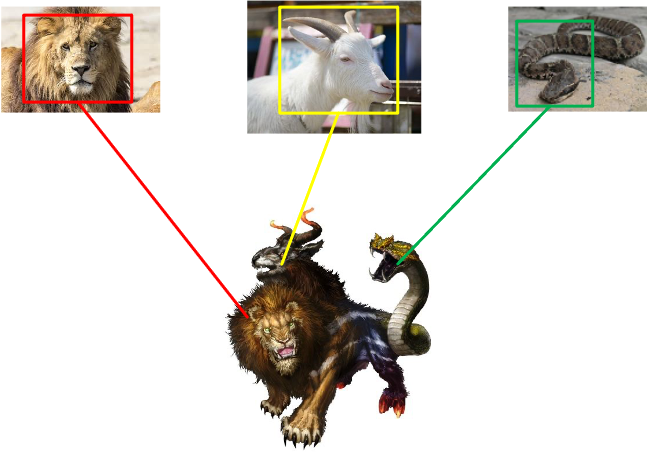
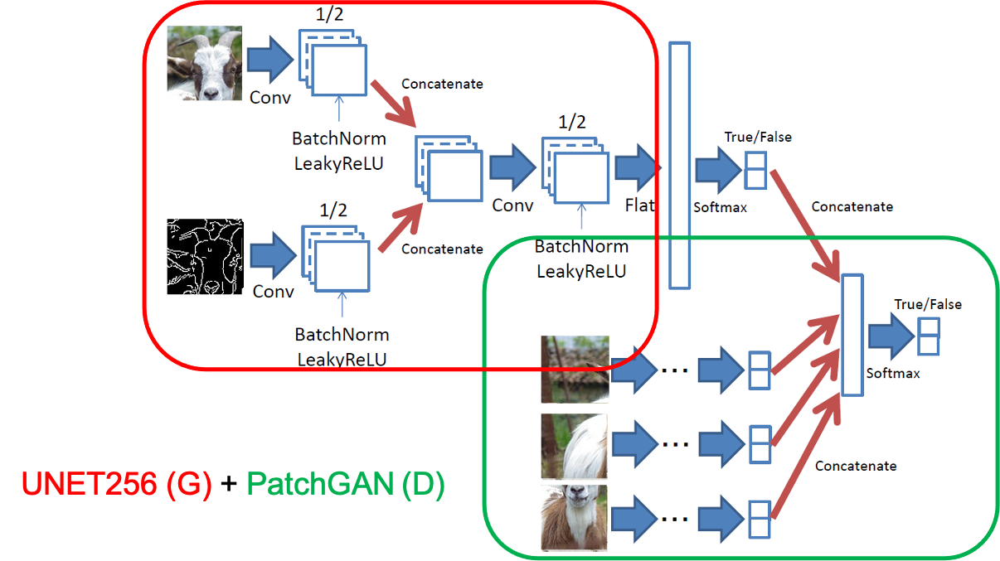
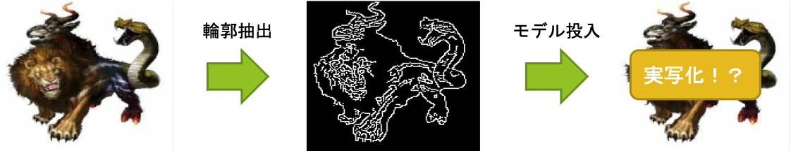

# キメラを召喚せよ！！cGANを用いたイラストの実写化

## 目的
GANの画像生成能力を検証するため、実在の動物から空想上の生物（キメラ）の生成に挑戦した。<br>
株式会社DIVE INTO CODE 機械学習コース2020年4月期卒業課題として発表。<br>

卒業発表スライド　https://www.slideshare.net/secret/3ix59l40s9GzBH <br>
DIVE INTO CODE課題一覧　https://github.com/genkitamiya/diveintocode-ml<br>

## 概要

キメラは様々な動物を組み合わせた生物である特性上、多様な動物をパーツごとに学習したGANは未知の生物も生成可能と考えた。多種の動物を用いることから、DCGANのように乱数からの生成では特徴が捉えきれずに学習が収束しない恐れがあるため、今回はラベル情報（教師あり）を使うconditional GANをモデルに採用した。中でも、対象物の輪郭から色付けを行えるpix2pixを採用。<br>
<br>
<br>

*pix2pix: UNET256の生成器とPatchGANの識別器との敵対ネットワーク*<br>
<br>
<br>
推論はキメライラストから抽出した輪郭画像を学習済モデルに投入する。<br>
<br>

## 使用方法<br>
## 前処理<br>
下記コマンドで推論用または学習用画像の輪郭画像を用意。<br>
画像は指定サイズの正方形に変換される（デフォルトは256）。<br>
輪郭抽出はauto canny法を採用
```
python preprocess.py --input path/to/input/dir --output path/to/output/dir --size int

```

## 参考
https://github.com/junyanz/pytorch-CycleGAN-and-pix2pix<br>
https://github.com/HelenMao/MSGAN<br>
https://www.pyimagesearch.com/2015/04/06/zero-parameter-automatic-canny-edge-detection-with-python-and-opencv/
