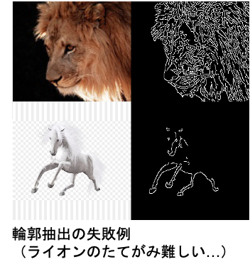

# キメラを召喚せよ！！cGANを用いたイラストの実写化

## 目的
GANの画像生成能力を検証するため、実在の動物から空想上の生物（キメラ）の生成に挑戦した。<br>
株式会社DIVE INTO CODE 機械学習コース2020年4月期卒業課題として発表。<br>

卒業発表スライド　https://www.slideshare.net/secret/3ix59l40s9GzBH <br>
DIVE INTO CODE課題一覧　https://github.com/genkitamiya/diveintocode-ml<br>

## 概要


キメラは様々な動物を組み合わせた生物である特性上、多様な動物をパーツごとに学習したGANは未知の生物も生成可能と考えた。多種の動物を用いることから、DCGANのように乱数からの生成では特徴が捉えきれずに学習が収束しない恐れがあるため、今回はラベル情報（教師あり）を使うconditional GANをモデルに採用した。中でも、対象物の輪郭から色付けを行えるPix2Pix<sup>[1](#参考)</sup>を採用。<br>
<br>
<br>
*Pix2Pix: UNET256の生成器とPatchGANの識別器との敵対ネットワーク*<br>
<br>
<br>
<br>
*推論はキメライラストから抽出した輪郭画像を学習済モデルに投入する。*<br>

## 開発環境
- AWS DeepLearning AMI + G4 Instance (T4 NVIDIA GPU)
- Python 3
- PyTorch 1.2

## 学習
### 1. 必要パッケージをインストール
```
pip install requirements.txt
```
### 2. 前処理
下記コマンド実行で学習用及び推論用画像の輪郭画像を用意。<br>
画像は指定サイズの正方形に変換され（デフォルトは256）、輪郭抽出はauto canny法<sup>[2](#参考)</sup>を採用。<br>
- 学習用データは格納ディレクトリをtrainとする
- 推論用データは格納ディレクトリをtestとする
```
python preprocess.py --input path/to/input/dir --output path/to/train_or_test/dir --size int
```

### 3. 学習
下記コマンドを実行。<br>
その他オプション引数については、./options内のbase_options.pyとtrain_options.pyを参照。
```
python train.py \ 
--dataroot ./path/to/train \    #２で作成したtrainのパス
--name name/for/model \         #任意の名前で問題ない
--model pix2pix \               #今回はPix2Pixのみのため、固定
--direction BtoA \              #preprocess.pyで作成する画像がBtoAのため、固定
```

## 4. キメラ生成（推論）
下記コマンドを実行。<br>
その他オプション引数については、./options内のbase_options.pyとtest_options.pyを参照。
```
python test.py \
--dataroot ./path/to/test \    #２で作成したtestのパス
--name name/of/model \         #使用するモデルの名前
--model pix2pix \              #今回はPix2Pixのみのため、固定
--direction BtoA \             #preprocess.pyで作成する画像がBtoAのため、固定
```

## 生成例
学習用画像はライオン、山羊、蛇、犬、馬、鳥、魚の７種を合計957枚用意（Google Imagesからスクレイピング、無背景の物を優先）。また、損失関数はLeast Square GAN (LSGAN)、Wasserstein GAN (WGAN)、Mode Seeking GAN (MSGAN)<sup>[3](#参考)</sup>の３種を検証。<br>
<br>
以下に最も綺麗に生成したLSGANの画像集と、各損失関数の特徴を記載。<br>

<br>
*LSGANの生成例（Epoch 800）*<br>
<br>
<br>
*各損失関数の生成例と特徴。Epocch400時で生成画像を比較し、最も綺麗に出力したLSGANを採用してEpoch800まで学習を行った。*<br>
<br>
全ての生成画像は下記参照↓
- [LSGAN epoch800](./results/LSGAN_256_All/epoch800/index.md)
- [LSGAN epoch400](./results/LSGAN_256_All/epoch400/index.md)
- [WGAN epoch400](./results/WGAN_256_NoBG/epoch400/index.md)
- [MSGAN epoch400](./results/MSGAN/epoch400/index.md)

## 課題
- 輪郭の抽出精度が学習及び生成画像の質に直結する。ライオンのたてがみは線が多く抽出されてしまったため、キメラの頭が上手く生成できなかった要因と思われる。<br>
<br>

## 参考
<sup>1</sup>https://github.com/junyanz/pytorch-CycleGAN-and-pix2pix<br>
<sup>2</sup>https://www.pyimagesearch.com/2015/04/06/zero-parameter-automatic-canny-edge-detection-with-python-and-opencv/<br>
<sup>3</sup>https://github.com/HelenMao/MSGAN
