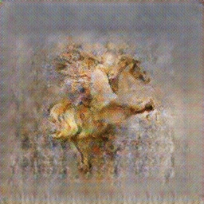
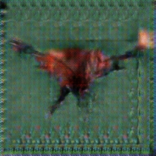

<!DOCTYPE html>
<html>
  <head>
    <title>Training = MSGAN_256A, Phase = test, Class =MSGAN_256A</title>
  </head>
  <body>
    <h3>input_000</h3>
    <table border="1" style="table-layout: fixed;">
      <tr>
        <td halign="center" style="word-wrap: break-word;" valign="top">
          

             
            
input

          

        </td>
        <td halign="center" style="word-wrap: break-word;" valign="top">
          

             
            
ground truth

          

        </td>
        <td halign="center" style="word-wrap: break-word;" valign="top">
          

             
            
encoded

          

        </td>
        <td halign="center" style="word-wrap: break-word;" valign="top">
          

             
            
random_sample01

          

        </td>
        <td halign="center" style="word-wrap: break-word;" valign="top">
          

             
            
random_sample02

          

        </td>
        <td halign="center" style="word-wrap: break-word;" valign="top">
          

             
            
random_sample03

          

        </td>
        <td halign="center" style="word-wrap: break-word;" valign="top">
          

             
            
random_sample04

          

        </td>
        <td halign="center" style="word-wrap: break-word;" valign="top">
          

             
            
random_sample05

          

        </td>
      </tr>
    </table>
    <h3>input_001</h3>
    <table border="1" style="table-layout: fixed;">
      <tr>
        <td halign="center" style="word-wrap: break-word;" valign="top">
          

             
            
input

          

        </td>
        <td halign="center" style="word-wrap: break-word;" valign="top">
          

             
            
ground truth

          

        </td>
        <td halign="center" style="word-wrap: break-word;" valign="top">
          

             
            
encoded

          

        </td>
        <td halign="center" style="word-wrap: break-word;" valign="top">
          

             
            
random_sample01

          

        </td>
        <td halign="center" style="word-wrap: break-word;" valign="top">
          

             
            
random_sample02

          

        </td>
        <td halign="center" style="word-wrap: break-word;" valign="top">
          

             
            
random_sample03

          

        </td>
        <td halign="center" style="word-wrap: break-word;" valign="top">
          

             
            
random_sample04

          

        </td>
        <td halign="center" style="word-wrap: break-word;" valign="top">
          

             
            
random_sample05

          

        </td>
      </tr>
    </table>
    <h3>input_002</h3>
    <table border="1" style="table-layout: fixed;">
      <tr>
        <td halign="center" style="word-wrap: break-word;" valign="top">
          

             
            
input

          

        </td>
        <td halign="center" style="word-wrap: break-word;" valign="top">
          

             
            
ground truth

          

        </td>
        <td halign="center" style="word-wrap: break-word;" valign="top">
          

             
            
encoded

          

        </td>
        <td halign="center" style="word-wrap: break-word;" valign="top">
          

             
            
random_sample01

          

        </td>
        <td halign="center" style="word-wrap: break-word;" valign="top">
          

             
            
random_sample02

          

        </td>
        <td halign="center" style="word-wrap: break-word;" valign="top">
          

             
            
random_sample03

          

        </td>
        <td halign="center" style="word-wrap: break-word;" valign="top">
          

             
            
random_sample04

          

        </td>
        <td halign="center" style="word-wrap: break-word;" valign="top">
          

             
            
random_sample05

          

        </td>
      </tr>
    </table>
    <h3>input_003</h3>
    <table border="1" style="table-layout: fixed;">
      <tr>
        <td halign="center" style="word-wrap: break-word;" valign="top">
          

             
            
input

          

        </td>
        <td halign="center" style="word-wrap: break-word;" valign="top">
          

             
            
ground truth

          

        </td>
        <td halign="center" style="word-wrap: break-word;" valign="top">
          

             
            
encoded

          

        </td>
        <td halign="center" style="word-wrap: break-word;" valign="top">
          

             
            
random_sample01

          

        </td>
        <td halign="center" style="word-wrap: break-word;" valign="top">
          

             
            
random_sample02

          

        </td>
        <td halign="center" style="word-wrap: break-word;" valign="top">
          

             
            
random_sample03

          

        </td>
        <td halign="center" style="word-wrap: break-word;" valign="top">
          

             
            
random_sample04

          

        </td>
        <td halign="center" style="word-wrap: break-word;" valign="top">
          

             
            
random_sample05

          

        </td>
      </tr>
    </table>
    <h3>input_004</h3>
    <table border="1" style="table-layout: fixed;">
      <tr>
        <td halign="center" style="word-wrap: break-word;" valign="top">
          

             
            
input

          

        </td>
        <td halign="center" style="word-wrap: break-word;" valign="top">
          

             
            
ground truth

          

        </td>
        <td halign="center" style="word-wrap: break-word;" valign="top">
          

             
            
encoded

          

        </td>
        <td halign="center" style="word-wrap: break-word;" valign="top">
          

             
            
random_sample01

          

        </td>
        <td halign="center" style="word-wrap: break-word;" valign="top">
          

             
            
random_sample02

          

        </td>
        <td halign="center" style="word-wrap: break-word;" valign="top">
          

             
            
random_sample03

          

        </td>
        <td halign="center" style="word-wrap: break-word;" valign="top">
          

             
            
random_sample04

          

        </td>
        <td halign="center" style="word-wrap: break-word;" valign="top">
          

             
            
random_sample05

          

        </td>
      </tr>
    </table>
    <h3>input_005</h3>
    <table border="1" style="table-layout: fixed;">
      <tr>
        <td halign="center" style="word-wrap: break-word;" valign="top">
          

             
            
input

          

        </td>
        <td halign="center" style="word-wrap: break-word;" valign="top">
          

             
            
ground truth

          

        </td>
        <td halign="center" style="word-wrap: break-word;" valign="top">
          

             
            
encoded

          

        </td>
        <td halign="center" style="word-wrap: break-word;" valign="top">
          

             
            
random_sample01

          

        </td>
        <td halign="center" style="word-wrap: break-word;" valign="top">
          

             
            
random_sample02

          

        </td>
        <td halign="center" style="word-wrap: break-word;" valign="top">
          

             
            
random_sample03

          

        </td>
        <td halign="center" style="word-wrap: break-word;" valign="top">
          

             
            
random_sample04

          

        </td>
        <td halign="center" style="word-wrap: break-word;" valign="top">
          

             
            
random_sample05

          

        </td>
      </tr>
    </table>
    <h3>input_006</h3>
    <table border="1" style="table-layout: fixed;">
      <tr>
        <td halign="center" style="word-wrap: break-word;" valign="top">
          

             
            
input

          

        </td>
        <td halign="center" style="word-wrap: break-word;" valign="top">
          

             
            
ground truth

          

        </td>
        <td halign="center" style="word-wrap: break-word;" valign="top">
          

             
            
encoded

          

        </td>
        <td halign="center" style="word-wrap: break-word;" valign="top">
          

             
            
random_sample01

          

        </td>
        <td halign="center" style="word-wrap: break-word;" valign="top">
          

             
            
random_sample02

          

        </td>
        <td halign="center" style="word-wrap: break-word;" valign="top">
          

             
            
random_sample03

          

        </td>
        <td halign="center" style="word-wrap: break-word;" valign="top">
          

             
            
random_sample04

          

        </td>
        <td halign="center" style="word-wrap: break-word;" valign="top">
          

             
            
random_sample05

          

        </td>
      </tr>
    </table>
    <h3>input_007</h3>
    <table border="1" style="table-layout: fixed;">
      <tr>
        <td halign="center" style="word-wrap: break-word;" valign="top">
          

             
            
input

          

        </td>
        <td halign="center" style="word-wrap: break-word;" valign="top">
          

             
            
ground truth

          

        </td>
        <td halign="center" style="word-wrap: break-word;" valign="top">
          

             
            
encoded

          

        </td>
        <td halign="center" style="word-wrap: break-word;" valign="top">
          

             
            
random_sample01

          

        </td>
        <td halign="center" style="word-wrap: break-word;" valign="top">
          

             
            
random_sample02

          

        </td>
        <td halign="center" style="word-wrap: break-word;" valign="top">
          

             
            
random_sample03

          

        </td>
        <td halign="center" style="word-wrap: break-word;" valign="top">
          

             
            
random_sample04

          

        </td>
        <td halign="center" style="word-wrap: break-word;" valign="top">
          

             
            
random_sample05

          

        </td>
      </tr>
    </table>
    <h3>input_008</h3>
    <table border="1" style="table-layout: fixed;">
      <tr>
        <td halign="center" style="word-wrap: break-word;" valign="top">
          

             
            
input

          

        </td>
        <td halign="center" style="word-wrap: break-word;" valign="top">
          

             
            
ground truth

          

        </td>
        <td halign="center" style="word-wrap: break-word;" valign="top">
          

             
            
encoded

          

        </td>
        <td halign="center" style="word-wrap: break-word;" valign="top">
          

             
            
random_sample01

          

        </td>
        <td halign="center" style="word-wrap: break-word;" valign="top">
          

             
            
random_sample02

          

        </td>
        <td halign="center" style="word-wrap: break-word;" valign="top">
          

             
            
random_sample03

          

        </td>
        <td halign="center" style="word-wrap: break-word;" valign="top">
          

             
            
random_sample04

          

        </td>
        <td halign="center" style="word-wrap: break-word;" valign="top">
          

             
            
random_sample05

          

        </td>
      </tr>
    </table>
    <h3>input_009</h3>
    <table border="1" style="table-layout: fixed;">
      <tr>
        <td halign="center" style="word-wrap: break-word;" valign="top">
          

             
            
input

          

        </td>
        <td halign="center" style="word-wrap: break-word;" valign="top">
          

             
            
ground truth

          

        </td>
        <td halign="center" style="word-wrap: break-word;" valign="top">
          

             
            
encoded

          

        </td>
        <td halign="center" style="word-wrap: break-word;" valign="top">
          

             
            
random_sample01

          

        </td>
        <td halign="center" style="word-wrap: break-word;" valign="top">
          

             
            
random_sample02

          

        </td>
        <td halign="center" style="word-wrap: break-word;" valign="top">
          

             
            
random_sample03

          

        </td>
        <td halign="center" style="word-wrap: break-word;" valign="top">
          

             
            
random_sample04

          

        </td>
        <td halign="center" style="word-wrap: break-word;" valign="top">
          

             
            
random_sample05

          

        </td>
      </tr>
    </table>
    <h3>input_010</h3>
    <table border="1" style="table-layout: fixed;">
      <tr>
        <td halign="center" style="word-wrap: break-word;" valign="top">
          

             
            
input

          

        </td>
        <td halign="center" style="word-wrap: break-word;" valign="top">
          

             
            
ground truth

          

        </td>
        <td halign="center" style="word-wrap: break-word;" valign="top">
          

             
            
encoded

          

        </td>
        <td halign="center" style="word-wrap: break-word;" valign="top">
          

             
            
random_sample01

          

        </td>
        <td halign="center" style="word-wrap: break-word;" valign="top">
          

             
            
random_sample02

          

        </td>
        <td halign="center" style="word-wrap: break-word;" valign="top">
          

             
            
random_sample03

          

        </td>
        <td halign="center" style="word-wrap: break-word;" valign="top">
          

             
            
random_sample04

          

        </td>
        <td halign="center" style="word-wrap: break-word;" valign="top">
          

             
            
random_sample05

          

        </td>
      </tr>
    </table>
    <h3>input_011</h3>
    <table border="1" style="table-layout: fixed;">
      <tr>
        <td halign="center" style="word-wrap: break-word;" valign="top">
          

             
            
input

          

        </td>
        <td halign="center" style="word-wrap: break-word;" valign="top">
          

             
            
ground truth

          

        </td>
        <td halign="center" style="word-wrap: break-word;" valign="top">
          

             
            
encoded

          

        </td>
        <td halign="center" style="word-wrap: break-word;" valign="top">
          

             
            
random_sample01

          

        </td>
        <td halign="center" style="word-wrap: break-word;" valign="top">
          

             
            
random_sample02

          

        </td>
        <td halign="center" style="word-wrap: break-word;" valign="top">
          

             
            
random_sample03

          

        </td>
        <td halign="center" style="word-wrap: break-word;" valign="top">
          

             
            
random_sample04

          

        </td>
        <td halign="center" style="word-wrap: break-word;" valign="top">
          

             
            
random_sample05

          

        </td>
      </tr>
    </table>
    <h3>input_012</h3>
    <table border="1" style="table-layout: fixed;">
      <tr>
        <td halign="center" style="word-wrap: break-word;" valign="top">
          

             
            
input

          

        </td>
        <td halign="center" style="word-wrap: break-word;" valign="top">
          

             
            
ground truth

          

        </td>
        <td halign="center" style="word-wrap: break-word;" valign="top">
          

             
            
encoded

          

        </td>
        <td halign="center" style="word-wrap: break-word;" valign="top">
          

             
            
random_sample01

          

        </td>
        <td halign="center" style="word-wrap: break-word;" valign="top">
          

             
            
random_sample02

          

        </td>
        <td halign="center" style="word-wrap: break-word;" valign="top">
          

             
            
random_sample03

          

        </td>
        <td halign="center" style="word-wrap: break-word;" valign="top">
          

             
            
random_sample04

          

        </td>
        <td halign="center" style="word-wrap: break-word;" valign="top">
          

             
            
random_sample05

          

        </td>
      </tr>
    </table>
    <h3>input_013</h3>
    <table border="1" style="table-layout: fixed;">
      <tr>
        <td halign="center" style="word-wrap: break-word;" valign="top">
          

             
            
input

          

        </td>
        <td halign="center" style="word-wrap: break-word;" valign="top">
          

             
            
ground truth

          

        </td>
        <td halign="center" style="word-wrap: break-word;" valign="top">
          

             
            
encoded

          

        </td>
        <td halign="center" style="word-wrap: break-word;" valign="top">
          

             
            
random_sample01

          

        </td>
        <td halign="center" style="word-wrap: break-word;" valign="top">
          

             
            
random_sample02

          

        </td>
        <td halign="center" style="word-wrap: break-word;" valign="top">
          

             
            
random_sample03

          

        </td>
        <td halign="center" style="word-wrap: break-word;" valign="top">
          

             
            
random_sample04

          

        </td>
        <td halign="center" style="word-wrap: break-word;" valign="top">
          

             
            
random_sample05

          

        </td>
      </tr>
    </table>
    <h3>input_014</h3>
    <table border="1" style="table-layout: fixed;">
      <tr>
        <td halign="center" style="word-wrap: break-word;" valign="top">
          

             
            
input

          

        </td>
        <td halign="center" style="word-wrap: break-word;" valign="top">
          

             
            
ground truth

          

        </td>
        <td halign="center" style="word-wrap: break-word;" valign="top">
          

             
            
encoded

          

        </td>
        <td halign="center" style="word-wrap: break-word;" valign="top">
          

             
            
random_sample01

          

        </td>
        <td halign="center" style="word-wrap: break-word;" valign="top">
          

             
            
random_sample02

          

        </td>
        <td halign="center" style="word-wrap: break-word;" valign="top">
          

             
            
random_sample03

          

        </td>
        <td halign="center" style="word-wrap: break-word;" valign="top">
          

             
            
random_sample04

          

        </td>
        <td halign="center" style="word-wrap: break-word;" valign="top">
          

             
            
random_sample05

          

        </td>
      </tr>
    </table>
    <h3>input_015</h3>
    <table border="1" style="table-layout: fixed;">
      <tr>
        <td halign="center" style="word-wrap: break-word;" valign="top">
          

             
            
input

          

        </td>
        <td halign="center" style="word-wrap: break-word;" valign="top">
          

             
            
ground truth

          

        </td>
        <td halign="center" style="word-wrap: break-word;" valign="top">
          

             
            
encoded

          

        </td>
        <td halign="center" style="word-wrap: break-word;" valign="top">
          

             
            
random_sample01

          

        </td>
        <td halign="center" style="word-wrap: break-word;" valign="top">
          

             
            
random_sample02

          

        </td>
        <td halign="center" style="word-wrap: break-word;" valign="top">
          

             
            
random_sample03

          

        </td>
        <td halign="center" style="word-wrap: break-word;" valign="top">
          

             
            
random_sample04

          

        </td>
        <td halign="center" style="word-wrap: break-word;" valign="top">
          

             
            
random_sample05

          

        </td>
      </tr>
    </table>
    <h3>input_016</h3>
    <table border="1" style="table-layout: fixed;">
      <tr>
        <td halign="center" style="word-wrap: break-word;" valign="top">
          

             
            
input

          

        </td>
        <td halign="center" style="word-wrap: break-word;" valign="top">
          

             
            
ground truth

          

        </td>
        <td halign="center" style="word-wrap: break-word;" valign="top">
          

             
            
encoded

          

        </td>
        <td halign="center" style="word-wrap: break-word;" valign="top">
          

             
            
random_sample01

          

        </td>
        <td halign="center" style="word-wrap: break-word;" valign="top">
          

             
            
random_sample02

          

        </td>
        <td halign="center" style="word-wrap: break-word;" valign="top">
          

             
            
random_sample03

          

        </td>
        <td halign="center" style="word-wrap: break-word;" valign="top">
          

             
            
random_sample04

          

        </td>
        <td halign="center" style="word-wrap: break-word;" valign="top">
          

             
            
random_sample05

          

        </td>
      </tr>
    </table>
    <h3>input_017</h3>
    <table border="1" style="table-layout: fixed;">
      <tr>
        <td halign="center" style="word-wrap: break-word;" valign="top">
          

             
            
input

          

        </td>
        <td halign="center" style="word-wrap: break-word;" valign="top">
          

             
            
ground truth

          

        </td>
        <td halign="center" style="word-wrap: break-word;" valign="top">
          

             
            
encoded

          

        </td>
        <td halign="center" style="word-wrap: break-word;" valign="top">
          

             
            
random_sample01

          

        </td>
        <td halign="center" style="word-wrap: break-word;" valign="top">
          

             
            
random_sample02

          

        </td>
        <td halign="center" style="word-wrap: break-word;" valign="top">
          

             
            
random_sample03

          

        </td>
        <td halign="center" style="word-wrap: break-word;" valign="top">
          

             
            
random_sample04

          

        </td>
        <td halign="center" style="word-wrap: break-word;" valign="top">
          

             
            
random_sample05

          

        </td>
      </tr>
    </table>
    <h3>input_018</h3>
    <table border="1" style="table-layout: fixed;">
      <tr>
        <td halign="center" style="word-wrap: break-word;" valign="top">
          

             
            
input

          

        </td>
        <td halign="center" style="word-wrap: break-word;" valign="top">
          

             
            
ground truth

          

        </td>
        <td halign="center" style="word-wrap: break-word;" valign="top">
          

             
            
encoded

          

        </td>
        <td halign="center" style="word-wrap: break-word;" valign="top">
          

             
            
random_sample01

          

        </td>
        <td halign="center" style="word-wrap: break-word;" valign="top">
          

             
            
random_sample02

          

        </td>
        <td halign="center" style="word-wrap: break-word;" valign="top">
          

             
            
random_sample03

          

        </td>
        <td halign="center" style="word-wrap: break-word;" valign="top">
          

             
            
random_sample04

          

        </td>
        <td halign="center" style="word-wrap: break-word;" valign="top">
          

             
            
random_sample05

          

        </td>
      </tr>
    </table>
    <h3>input_019</h3>
    <table border="1" style="table-layout: fixed;">
      <tr>
        <td halign="center" style="word-wrap: break-word;" valign="top">
          

             
            
input

          

        </td>
        <td halign="center" style="word-wrap: break-word;" valign="top">
          

             
            
ground truth

          

        </td>
        <td halign="center" style="word-wrap: break-word;" valign="top">
          

             
            
encoded

          

        </td>
        <td halign="center" style="word-wrap: break-word;" valign="top">
          

             
            
random_sample01

          

        </td>
        <td halign="center" style="word-wrap: break-word;" valign="top">
          

             
            
random_sample02

          

        </td>
        <td halign="center" style="word-wrap: break-word;" valign="top">
          

             
            
random_sample03

          

        </td>
        <td halign="center" style="word-wrap: break-word;" valign="top">
          

             
            
random_sample04

          

        </td>
        <td halign="center" style="word-wrap: break-word;" valign="top">
          

             
            
random_sample05

          

        </td>
      </tr>
    </table>
    <h3>input_020</h3>
    <table border="1" style="table-layout: fixed;">
      <tr>
        <td halign="center" style="word-wrap: break-word;" valign="top">
          

             
            
input

          

        </td>
        <td halign="center" style="word-wrap: break-word;" valign="top">
          

             
            
ground truth

          

        </td>
        <td halign="center" style="word-wrap: break-word;" valign="top">
          

             
            
encoded

          

        </td>
        <td halign="center" style="word-wrap: break-word;" valign="top">
          

             
            
random_sample01

          

        </td>
        <td halign="center" style="word-wrap: break-word;" valign="top">
          

             
            
random_sample02

          

        </td>
        <td halign="center" style="word-wrap: break-word;" valign="top">
          

             
            
random_sample03

          

        </td>
        <td halign="center" style="word-wrap: break-word;" valign="top">
          

             
            
random_sample04

          

        </td>
        <td halign="center" style="word-wrap: break-word;" valign="top">
          

             
            
random_sample05

          

        </td>
      </tr>
    </table>
    <h3>input_021</h3>
    <table border="1" style="table-layout: fixed;">
      <tr>
        <td halign="center" style="word-wrap: break-word;" valign="top">
          

             
            
input

          

        </td>
        <td halign="center" style="word-wrap: break-word;" valign="top">
          

             
            
ground truth

          

        </td>
        <td halign="center" style="word-wrap: break-word;" valign="top">
          

             
            
encoded

          

        </td>
        <td halign="center" style="word-wrap: break-word;" valign="top">
          

             
            
random_sample01

          

        </td>
        <td halign="center" style="word-wrap: break-word;" valign="top">
          

             
            
random_sample02

          

        </td>
        <td halign="center" style="word-wrap: break-word;" valign="top">
          

             
            
random_sample03

          

        </td>
        <td halign="center" style="word-wrap: break-word;" valign="top">
          

             
            
random_sample04

          

        </td>
        <td halign="center" style="word-wrap: break-word;" valign="top">
          

             
            
random_sample05

          

        </td>
      </tr>
    </table>
    <h3>input_022</h3>
    <table border="1" style="table-layout: fixed;">
      <tr>
        <td halign="center" style="word-wrap: break-word;" valign="top">
          

             
            
input

          

        </td>
        <td halign="center" style="word-wrap: break-word;" valign="top">
          

             
            
ground truth

          

        </td>
        <td halign="center" style="word-wrap: break-word;" valign="top">
          

             
            
encoded

          

        </td>
        <td halign="center" style="word-wrap: break-word;" valign="top">
          

             
            
random_sample01

          

        </td>
        <td halign="center" style="word-wrap: break-word;" valign="top">
          

             
            
random_sample02

          

        </td>
        <td halign="center" style="word-wrap: break-word;" valign="top">
          

             
            
random_sample03

          

        </td>
        <td halign="center" style="word-wrap: break-word;" valign="top">
          

             
            
random_sample04

          

        </td>
        <td halign="center" style="word-wrap: break-word;" valign="top">
          

             
            
random_sample05

          

        </td>
      </tr>
    </table>
    <h3>input_023</h3>
    <table border="1" style="table-layout: fixed;">
      <tr>
        <td halign="center" style="word-wrap: break-word;" valign="top">
          

             
            
input

          

        </td>
        <td halign="center" style="word-wrap: break-word;" valign="top">
          

             
            
ground truth

          

        </td>
        <td halign="center" style="word-wrap: break-word;" valign="top">
          

             
            
encoded

          

        </td>
        <td halign="center" style="word-wrap: break-word;" valign="top">
          

             
            
random_sample01

          

        </td>
        <td halign="center" style="word-wrap: break-word;" valign="top">
          

             
            
random_sample02

          

        </td>
        <td halign="center" style="word-wrap: break-word;" valign="top">
          

             
            
random_sample03

          

        </td>
        <td halign="center" style="word-wrap: break-word;" valign="top">
          

             
            
random_sample04

          

        </td>
        <td halign="center" style="word-wrap: break-word;" valign="top">
          

             
            
random_sample05

          

        </td>
      </tr>
    </table>
    <h3>input_024</h3>
    <table border="1" style="table-layout: fixed;">
      <tr>
        <td halign="center" style="word-wrap: break-word;" valign="top">
          

             
            
input

          

        </td>
        <td halign="center" style="word-wrap: break-word;" valign="top">
          

             
            
ground truth

          

        </td>
        <td halign="center" style="word-wrap: break-word;" valign="top">
          

             
            
encoded

          

        </td>
        <td halign="center" style="word-wrap: break-word;" valign="top">
          

             
            
random_sample01

          

        </td>
        <td halign="center" style="word-wrap: break-word;" valign="top">
          

             
            
random_sample02

          

        </td>
        <td halign="center" style="word-wrap: break-word;" valign="top">
          

             
            
random_sample03

          

        </td>
        <td halign="center" style="word-wrap: break-word;" valign="top">
          

             
            
random_sample04

          

        </td>
        <td halign="center" style="word-wrap: break-word;" valign="top">
          

             
            
random_sample05

          

        </td>
      </tr>
    </table>
    <h3>input_025</h3>
    <table border="1" style="table-layout: fixed;">
      <tr>
        <td halign="center" style="word-wrap: break-word;" valign="top">
          

             
            
input

          

        </td>
        <td halign="center" style="word-wrap: break-word;" valign="top">
          

             
            
ground truth

          

        </td>
        <td halign="center" style="word-wrap: break-word;" valign="top">
          

             
            
encoded

          

        </td>
        <td halign="center" style="word-wrap: break-word;" valign="top">
          

             
            
random_sample01

          

        </td>
        <td halign="center" style="word-wrap: break-word;" valign="top">
          

             
            
random_sample02

          

        </td>
        <td halign="center" style="word-wrap: break-word;" valign="top">
          

             
            
random_sample03

          

        </td>
        <td halign="center" style="word-wrap: break-word;" valign="top">
          

             
            
random_sample04

          

        </td>
        <td halign="center" style="word-wrap: break-word;" valign="top">
          

             
            
random_sample05

          

        </td>
      </tr>
    </table>
    <h3>input_026</h3>
    <table border="1" style="table-layout: fixed;">
      <tr>
        <td halign="center" style="word-wrap: break-word;" valign="top">
          

             
            
input

          

        </td>
        <td halign="center" style="word-wrap: break-word;" valign="top">
          

             
            
ground truth

          

        </td>
        <td halign="center" style="word-wrap: break-word;" valign="top">
          

             
            
encoded

          

        </td>
        <td halign="center" style="word-wrap: break-word;" valign="top">
          

             
            
random_sample01

          

        </td>
        <td halign="center" style="word-wrap: break-word;" valign="top">
          

             
            
random_sample02

          

        </td>
        <td halign="center" style="word-wrap: break-word;" valign="top">
          

             
            
random_sample03

          

        </td>
        <td halign="center" style="word-wrap: break-word;" valign="top">
          

             
            
random_sample04

          

        </td>
        <td halign="center" style="word-wrap: break-word;" valign="top">
          

             
            
random_sample05

          

        </td>
      </tr>
    </table>
    <h3>input_027</h3>
    <table border="1" style="table-layout: fixed;">
      <tr>
        <td halign="center" style="word-wrap: break-word;" valign="top">
          

             
            
input

          

        </td>
        <td halign="center" style="word-wrap: break-word;" valign="top">
          

             
            
ground truth

          

        </td>
        <td halign="center" style="word-wrap: break-word;" valign="top">
          

             
            
encoded

          

        </td>
        <td halign="center" style="word-wrap: break-word;" valign="top">
          

             
            
random_sample01

          

        </td>
        <td halign="center" style="word-wrap: break-word;" valign="top">
          

             
            
random_sample02

          

        </td>
        <td halign="center" style="word-wrap: break-word;" valign="top">
          

             
            
random_sample03

          

        </td>
        <td halign="center" style="word-wrap: break-word;" valign="top">
          

             
            
random_sample04

          

        </td>
        <td halign="center" style="word-wrap: break-word;" valign="top">
          

             
            
random_sample05

          

        </td>
      </tr>
    </table>
    <h3>input_028</h3>
    <table border="1" style="table-layout: fixed;">
      <tr>
        <td halign="center" style="word-wrap: break-word;" valign="top">
          

             
            
input

          

        </td>
        <td halign="center" style="word-wrap: break-word;" valign="top">
          

             
            
ground truth

          

        </td>
        <td halign="center" style="word-wrap: break-word;" valign="top">
          

             
            
encoded

          

        </td>
        <td halign="center" style="word-wrap: break-word;" valign="top">
          

             
            
random_sample01

          

        </td>
        <td halign="center" style="word-wrap: break-word;" valign="top">
          

             
            
random_sample02

          

        </td>
        <td halign="center" style="word-wrap: break-word;" valign="top">
          

             
            
random_sample03

          

        </td>
        <td halign="center" style="word-wrap: break-word;" valign="top">
          

             
            
random_sample04

          

        </td>
        <td halign="center" style="word-wrap: break-word;" valign="top">
          

             
            
random_sample05

          

        </td>
      </tr>
    </table>
    <h3>input_029</h3>
    <table border="1" style="table-layout: fixed;">
      <tr>
        <td halign="center" style="word-wrap: break-word;" valign="top">
          

             
            
input

          

        </td>
        <td halign="center" style="word-wrap: break-word;" valign="top">
          

             
            
ground truth

          

        </td>
        <td halign="center" style="word-wrap: break-word;" valign="top">
          

             
            
encoded

          

        </td>
        <td halign="center" style="word-wrap: break-word;" valign="top">
          

             
            
random_sample01

          

        </td>
        <td halign="center" style="word-wrap: break-word;" valign="top">
          

             
            
random_sample02

          

        </td>
        <td halign="center" style="word-wrap: break-word;" valign="top">
          

             
            
random_sample03

          

        </td>
        <td halign="center" style="word-wrap: break-word;" valign="top">
          

             
            
random_sample04

          

        </td>
        <td halign="center" style="word-wrap: break-word;" valign="top">
          

             
            
random_sample05

          

        </td>
      </tr>
    </table>
    <h3>input_030</h3>
    <table border="1" style="table-layout: fixed;">
      <tr>
        <td halign="center" style="word-wrap: break-word;" valign="top">
          

             
            
input

          

        </td>
        <td halign="center" style="word-wrap: break-word;" valign="top">
          

             
            
ground truth

          

        </td>
        <td halign="center" style="word-wrap: break-word;" valign="top">
          

             
            
encoded

          

        </td>
        <td halign="center" style="word-wrap: break-word;" valign="top">
          

             
            
random_sample01

          

        </td>
        <td halign="center" style="word-wrap: break-word;" valign="top">
          

             
            
random_sample02

          

        </td>
        <td halign="center" style="word-wrap: break-word;" valign="top">
          

             
            
random_sample03

          

        </td>
        <td halign="center" style="word-wrap: break-word;" valign="top">
          

             
            
random_sample04

          

        </td>
        <td halign="center" style="word-wrap: break-word;" valign="top">
          

             
            
random_sample05

          

        </td>
      </tr>
    </table>
    <h3>input_031</h3>
    <table border="1" style="table-layout: fixed;">
      <tr>
        <td halign="center" style="word-wrap: break-word;" valign="top">
          

             
            
input

          

        </td>
        <td halign="center" style="word-wrap: break-word;" valign="top">
          

             
            
ground truth

          

        </td>
        <td halign="center" style="word-wrap: break-word;" valign="top">
          

             
            
encoded

          

        </td>
        <td halign="center" style="word-wrap: break-word;" valign="top">
          

             
            
random_sample01

          

        </td>
        <td halign="center" style="word-wrap: break-word;" valign="top">
          

             
            
random_sample02

          

        </td>
        <td halign="center" style="word-wrap: break-word;" valign="top">
          

             
            
random_sample03

          

        </td>
        <td halign="center" style="word-wrap: break-word;" valign="top">
          

             
            
random_sample04

          

        </td>
        <td halign="center" style="word-wrap: break-word;" valign="top">
          

             
            
random_sample05

          

        </td>
      </tr>
    </table>
    <h3>input_032</h3>
    <table border="1" style="table-layout: fixed;">
      <tr>
        <td halign="center" style="word-wrap: break-word;" valign="top">
          

             
            
input

          

        </td>
        <td halign="center" style="word-wrap: break-word;" valign="top">
          

             
            
ground truth

          

        </td>
        <td halign="center" style="word-wrap: break-word;" valign="top">
          

             
            
encoded

          

        </td>
        <td halign="center" style="word-wrap: break-word;" valign="top">
          

             
            
random_sample01

          

        </td>
        <td halign="center" style="word-wrap: break-word;" valign="top">
          

             
            
random_sample02

          

        </td>
        <td halign="center" style="word-wrap: break-word;" valign="top">
          

             
            
random_sample03

          

        </td>
        <td halign="center" style="word-wrap: break-word;" valign="top">
          

             
            
random_sample04

          

        </td>
        <td halign="center" style="word-wrap: break-word;" valign="top">
          

             
            
random_sample05

          

        </td>
      </tr>
    </table>
    <h3>input_033</h3>
    <table border="1" style="table-layout: fixed;">
      <tr>
        <td halign="center" style="word-wrap: break-word;" valign="top">
          

             
            
input

          

        </td>
        <td halign="center" style="word-wrap: break-word;" valign="top">
          

             
            
ground truth

          

        </td>
        <td halign="center" style="word-wrap: break-word;" valign="top">
          

             
            
encoded

          

        </td>
        <td halign="center" style="word-wrap: break-word;" valign="top">
          

             
            
random_sample01

          

        </td>
        <td halign="center" style="word-wrap: break-word;" valign="top">
          

             
            
random_sample02

          

        </td>
        <td halign="center" style="word-wrap: break-word;" valign="top">
          

             
            
random_sample03

          

        </td>
        <td halign="center" style="word-wrap: break-word;" valign="top">
          

             
            
random_sample04

          

        </td>
        <td halign="center" style="word-wrap: break-word;" valign="top">
          

             
            
random_sample05

          

        </td>
      </tr>
    </table>
    <h3>input_034</h3>
    <table border="1" style="table-layout: fixed;">
      <tr>
        <td halign="center" style="word-wrap: break-word;" valign="top">
          

             
            
input

          

        </td>
        <td halign="center" style="word-wrap: break-word;" valign="top">
          

             
            
ground truth

          

        </td>
        <td halign="center" style="word-wrap: break-word;" valign="top">
          

             
            
encoded

          

        </td>
        <td halign="center" style="word-wrap: break-word;" valign="top">
          

             
            
random_sample01

          

        </td>
        <td halign="center" style="word-wrap: break-word;" valign="top">
          

             
            
random_sample02

          

        </td>
        <td halign="center" style="word-wrap: break-word;" valign="top">
          

             
            
random_sample03

          

        </td>
        <td halign="center" style="word-wrap: break-word;" valign="top">
          

             
            
random_sample04

          

        </td>
        <td halign="center" style="word-wrap: break-word;" valign="top">
          

             
            
random_sample05

          

        </td>
      </tr>
    </table>
    <h3>input_035</h3>
    <table border="1" style="table-layout: fixed;">
      <tr>
        <td halign="center" style="word-wrap: break-word;" valign="top">
          

             
            
input

          

        </td>
        <td halign="center" style="word-wrap: break-word;" valign="top">
          

             
            
ground truth

          

        </td>
        <td halign="center" style="word-wrap: break-word;" valign="top">
          

             
            
encoded

          

        </td>
        <td halign="center" style="word-wrap: break-word;" valign="top">
          

             
            
random_sample01

          

        </td>
        <td halign="center" style="word-wrap: break-word;" valign="top">
          

             
            
random_sample02

          

        </td>
        <td halign="center" style="word-wrap: break-word;" valign="top">
          

             
            
random_sample03

          

        </td>
        <td halign="center" style="word-wrap: break-word;" valign="top">
          

             
            
random_sample04

          

        </td>
        <td halign="center" style="word-wrap: break-word;" valign="top">
          

             
            
random_sample05

          

        </td>
      </tr>
    </table>
    <h3>input_036</h3>
    <table border="1" style="table-layout: fixed;">
      <tr>
        <td halign="center" style="word-wrap: break-word;" valign="top">
          

             
            
input

          

        </td>
        <td halign="center" style="word-wrap: break-word;" valign="top">
          

             
            
ground truth

          

        </td>
        <td halign="center" style="word-wrap: break-word;" valign="top">
          

             
            
encoded

          

        </td>
        <td halign="center" style="word-wrap: break-word;" valign="top">
          

             
            
random_sample01

          

        </td>
        <td halign="center" style="word-wrap: break-word;" valign="top">
          

             
            
random_sample02

          

        </td>
        <td halign="center" style="word-wrap: break-word;" valign="top">
          

             
            
random_sample03

          

        </td>
        <td halign="center" style="word-wrap: break-word;" valign="top">
          

             
            
random_sample04

          

        </td>
        <td halign="center" style="word-wrap: break-word;" valign="top">
          

             
            
random_sample05

          

        </td>
      </tr>
    </table>
    <h3>input_037</h3>
    <table border="1" style="table-layout: fixed;">
      <tr>
        <td halign="center" style="word-wrap: break-word;" valign="top">
          

             
            
input

          

        </td>
        <td halign="center" style="word-wrap: break-word;" valign="top">
          

             
            
ground truth

          

        </td>
        <td halign="center" style="word-wrap: break-word;" valign="top">
          

             
            
encoded

          

        </td>
        <td halign="center" style="word-wrap: break-word;" valign="top">
          

             
            
random_sample01

          

        </td>
        <td halign="center" style="word-wrap: break-word;" valign="top">
          

             
            
random_sample02

          

        </td>
        <td halign="center" style="word-wrap: break-word;" valign="top">
          

             
            
random_sample03

          

        </td>
        <td halign="center" style="word-wrap: break-word;" valign="top">
          

             
            
random_sample04

          

        </td>
        <td halign="center" style="word-wrap: break-word;" valign="top">
          

             
            
random_sample05

          

        </td>
      </tr>
    </table>
    <h3>input_038</h3>
    <table border="1" style="table-layout: fixed;">
      <tr>
        <td halign="center" style="word-wrap: break-word;" valign="top">
          

             
            
input

          

        </td>
        <td halign="center" style="word-wrap: break-word;" valign="top">
          

             
            
ground truth

          

        </td>
        <td halign="center" style="word-wrap: break-word;" valign="top">
          

             
            
encoded

          

        </td>
        <td halign="center" style="word-wrap: break-word;" valign="top">
          

             
            
random_sample01

          

        </td>
        <td halign="center" style="word-wrap: break-word;" valign="top">
          

             
            
random_sample02

          

        </td>
        <td halign="center" style="word-wrap: break-word;" valign="top">
          

             
            
random_sample03

          

        </td>
        <td halign="center" style="word-wrap: break-word;" valign="top">
          

             
            
random_sample04

          

        </td>
        <td halign="center" style="word-wrap: break-word;" valign="top">
          

             
            
random_sample05

          

        </td>
      </tr>
    </table>
    <h3>input_039</h3>
    <table border="1" style="table-layout: fixed;">
      <tr>
        <td halign="center" style="word-wrap: break-word;" valign="top">
          

             
            
input

          

        </td>
        <td halign="center" style="word-wrap: break-word;" valign="top">
          

             
            
ground truth

          

        </td>
        <td halign="center" style="word-wrap: break-word;" valign="top">
          

             
            
encoded

          

        </td>
        <td halign="center" style="word-wrap: break-word;" valign="top">
          

             
            
random_sample01

          

        </td>
        <td halign="center" style="word-wrap: break-word;" valign="top">
          

             
            
random_sample02

          

        </td>
        <td halign="center" style="word-wrap: break-word;" valign="top">
          

             
            
random_sample03

          

        </td>
        <td halign="center" style="word-wrap: break-word;" valign="top">
          

             
            
random_sample04

          

        </td>
        <td halign="center" style="word-wrap: break-word;" valign="top">
          

             
            
random_sample05

          

        </td>
      </tr>
    </table>
    <h3>input_040</h3>
    <table border="1" style="table-layout: fixed;">
      <tr>
        <td halign="center" style="word-wrap: break-word;" valign="top">
          

             
            
input

          

        </td>
        <td halign="center" style="word-wrap: break-word;" valign="top">
          

             
            
ground truth

          

        </td>
        <td halign="center" style="word-wrap: break-word;" valign="top">
          

             
            
encoded

          

        </td>
        <td halign="center" style="word-wrap: break-word;" valign="top">
          

             
            
random_sample01

          

        </td>
        <td halign="center" style="word-wrap: break-word;" valign="top">
          

             
            
random_sample02

          

        </td>
        <td halign="center" style="word-wrap: break-word;" valign="top">
          

             
            
random_sample03

          

        </td>
        <td halign="center" style="word-wrap: break-word;" valign="top">
          

             
            
random_sample04

          

        </td>
        <td halign="center" style="word-wrap: break-word;" valign="top">
          

             
            
random_sample05

          

        </td>
      </tr>
    </table>
    <h3>input_041</h3>
    <table border="1" style="table-layout: fixed;">
      <tr>
        <td halign="center" style="word-wrap: break-word;" valign="top">
          

             
            
input

          

        </td>
        <td halign="center" style="word-wrap: break-word;" valign="top">
          

             
            
ground truth

          

        </td>
        <td halign="center" style="word-wrap: break-word;" valign="top">
          

             
            
encoded

          

        </td>
        <td halign="center" style="word-wrap: break-word;" valign="top">
          

             
            
random_sample01

          

        </td>
        <td halign="center" style="word-wrap: break-word;" valign="top">
          

             
            
random_sample02

          

        </td>
        <td halign="center" style="word-wrap: break-word;" valign="top">
          

             
            
random_sample03

          

        </td>
        <td halign="center" style="word-wrap: break-word;" valign="top">
          

             
            
random_sample04

          

        </td>
        <td halign="center" style="word-wrap: break-word;" valign="top">
          

             
            
random_sample05

          

        </td>
      </tr>
    </table>
    <h3>input_042</h3>
    <table border="1" style="table-layout: fixed;">
      <tr>
        <td halign="center" style="word-wrap: break-word;" valign="top">
          

             
            
input

          

        </td>
        <td halign="center" style="word-wrap: break-word;" valign="top">
          

             
            
ground truth

          

        </td>
        <td halign="center" style="word-wrap: break-word;" valign="top">
          

             
            
encoded

          

        </td>
        <td halign="center" style="word-wrap: break-word;" valign="top">
          

             
            
random_sample01

          

        </td>
        <td halign="center" style="word-wrap: break-word;" valign="top">
          

             
            
random_sample02

          

        </td>
        <td halign="center" style="word-wrap: break-word;" valign="top">
          

             
            
random_sample03

          

        </td>
        <td halign="center" style="word-wrap: break-word;" valign="top">
          

             
            
random_sample04

          

        </td>
        <td halign="center" style="word-wrap: break-word;" valign="top">
          

             
            
random_sample05

          

        </td>
      </tr>
    </table>
    <h3>input_043</h3>
    <table border="1" style="table-layout: fixed;">
      <tr>
        <td halign="center" style="word-wrap: break-word;" valign="top">
          

             
            
input

          

        </td>
        <td halign="center" style="word-wrap: break-word;" valign="top">
          

             
            
ground truth

          

        </td>
        <td halign="center" style="word-wrap: break-word;" valign="top">
          

             
            
encoded

          

        </td>
        <td halign="center" style="word-wrap: break-word;" valign="top">
          

             
            
random_sample01

          

        </td>
        <td halign="center" style="word-wrap: break-word;" valign="top">
          

             
            
random_sample02

          

        </td>
        <td halign="center" style="word-wrap: break-word;" valign="top">
          

             
            
random_sample03

          

        </td>
        <td halign="center" style="word-wrap: break-word;" valign="top">
          

             
            
random_sample04

          

        </td>
        <td halign="center" style="word-wrap: break-word;" valign="top">
          

             
            
random_sample05

          

        </td>
      </tr>
    </table>
    <h3>input_044</h3>
    <table border="1" style="table-layout: fixed;">
      <tr>
        <td halign="center" style="word-wrap: break-word;" valign="top">
          

             
            
input

          

        </td>
        <td halign="center" style="word-wrap: break-word;" valign="top">
          

             
            
ground truth

          

        </td>
        <td halign="center" style="word-wrap: break-word;" valign="top">
          

             
            
encoded

          

        </td>
        <td halign="center" style="word-wrap: break-word;" valign="top">
          

             
            
random_sample01

          

        </td>
        <td halign="center" style="word-wrap: break-word;" valign="top">
          

             
            
random_sample02

          

        </td>
        <td halign="center" style="word-wrap: break-word;" valign="top">
          

             
            
random_sample03

          

        </td>
        <td halign="center" style="word-wrap: break-word;" valign="top">
          

             
            
random_sample04

          

        </td>
        <td halign="center" style="word-wrap: break-word;" valign="top">
          

             
            
random_sample05

          

        </td>
      </tr>
    </table>
    <h3>input_045</h3>
    <table border="1" style="table-layout: fixed;">
      <tr>
        <td halign="center" style="word-wrap: break-word;" valign="top">
          

             
            
input

          

        </td>
        <td halign="center" style="word-wrap: break-word;" valign="top">
          

             
            
ground truth

          

        </td>
        <td halign="center" style="word-wrap: break-word;" valign="top">
          

             
            
encoded

          

        </td>
        <td halign="center" style="word-wrap: break-word;" valign="top">
          

             
            
random_sample01

          

        </td>
        <td halign="center" style="word-wrap: break-word;" valign="top">
          

             
            
random_sample02

          

        </td>
        <td halign="center" style="word-wrap: break-word;" valign="top">
          

             
            
random_sample03

          

        </td>
        <td halign="center" style="word-wrap: break-word;" valign="top">
          

             
            
random_sample04

          

        </td>
        <td halign="center" style="word-wrap: break-word;" valign="top">
          

             
            
random_sample05

          

        </td>
      </tr>
    </table>
    <h3>input_046</h3>
    <table border="1" style="table-layout: fixed;">
      <tr>
        <td halign="center" style="word-wrap: break-word;" valign="top">
          

             
            
input

          

        </td>
        <td halign="center" style="word-wrap: break-word;" valign="top">
          

             
            
ground truth

          

        </td>
        <td halign="center" style="word-wrap: break-word;" valign="top">
          

             
            
encoded

          

        </td>
        <td halign="center" style="word-wrap: break-word;" valign="top">
          

             
            
random_sample01

          

        </td>
        <td halign="center" style="word-wrap: break-word;" valign="top">
          

             
            
random_sample02

          

        </td>
        <td halign="center" style="word-wrap: break-word;" valign="top">
          

             
            
random_sample03

          

        </td>
        <td halign="center" style="word-wrap: break-word;" valign="top">
          

             
            
random_sample04

          

        </td>
        <td halign="center" style="word-wrap: break-word;" valign="top">
          

             
            
random_sample05

          

        </td>
      </tr>
    </table>
    <h3>input_047</h3>
    <table border="1" style="table-layout: fixed;">
      <tr>
        <td halign="center" style="word-wrap: break-word;" valign="top">
          

             
            
input

          

        </td>
        <td halign="center" style="word-wrap: break-word;" valign="top">
          

             
            
ground truth

          

        </td>
        <td halign="center" style="word-wrap: break-word;" valign="top">
          

             
            
encoded

          

        </td>
        <td halign="center" style="word-wrap: break-word;" valign="top">
          

             
            
random_sample01

          

        </td>
        <td halign="center" style="word-wrap: break-word;" valign="top">
          

             
            
random_sample02

          

        </td>
        <td halign="center" style="word-wrap: break-word;" valign="top">
          

             
            
random_sample03

          

        </td>
        <td halign="center" style="word-wrap: break-word;" valign="top">
          

             
            
random_sample04

          

        </td>
        <td halign="center" style="word-wrap: break-word;" valign="top">
          

             
            
random_sample05

          

        </td>
      </tr>
    </table>
    <h3>input_048</h3>
    <table border="1" style="table-layout: fixed;">
      <tr>
        <td halign="center" style="word-wrap: break-word;" valign="top">
          

             
            
input

          

        </td>
        <td halign="center" style="word-wrap: break-word;" valign="top">
          

             
            
ground truth

          

        </td>
        <td halign="center" style="word-wrap: break-word;" valign="top">
          

             
            
encoded

          

        </td>
        <td halign="center" style="word-wrap: break-word;" valign="top">
          

             
            
random_sample01

          

        </td>
        <td halign="center" style="word-wrap: break-word;" valign="top">
          

             
            
random_sample02

          

        </td>
        <td halign="center" style="word-wrap: break-word;" valign="top">
          

             
            
random_sample03

          

        </td>
        <td halign="center" style="word-wrap: break-word;" valign="top">
          

             
            
random_sample04

          

        </td>
        <td halign="center" style="word-wrap: break-word;" valign="top">
          

             
            
random_sample05

          

        </td>
      </tr>
    </table>
    <h3>input_049</h3>
    <table border="1" style="table-layout: fixed;">
      <tr>
        <td halign="center" style="word-wrap: break-word;" valign="top">
          

             
            
input

          

        </td>
        <td halign="center" style="word-wrap: break-word;" valign="top">
          

             
            
ground truth

          

        </td>
        <td halign="center" style="word-wrap: break-word;" valign="top">
          

             
            
encoded

          

        </td>
        <td halign="center" style="word-wrap: break-word;" valign="top">
          

             
            
random_sample01

          

        </td>
        <td halign="center" style="word-wrap: break-word;" valign="top">
          

             
            
random_sample02

          

        </td>
        <td halign="center" style="word-wrap: break-word;" valign="top">
          

             
            
random_sample03

          

        </td>
        <td halign="center" style="word-wrap: break-word;" valign="top">
          

             
            
random_sample04

          

        </td>
        <td halign="center" style="word-wrap: break-word;" valign="top">
          

             
            
random_sample05

          

        </td>
      </tr>
    </table>
    <h3>input_050</h3>
    <table border="1" style="table-layout: fixed;">
      <tr>
        <td halign="center" style="word-wrap: break-word;" valign="top">
          

             
            
input

          

        </td>
        <td halign="center" style="word-wrap: break-word;" valign="top">
          

             
            
ground truth

          

        </td>
        <td halign="center" style="word-wrap: break-word;" valign="top">
          

             
            
encoded

          

        </td>
        <td halign="center" style="word-wrap: break-word;" valign="top">
          

             
            
random_sample01

          

        </td>
        <td halign="center" style="word-wrap: break-word;" valign="top">
          

             
            
random_sample02

          

        </td>
        <td halign="center" style="word-wrap: break-word;" valign="top">
          

             
            
random_sample03

          

        </td>
        <td halign="center" style="word-wrap: break-word;" valign="top">
          

             
            
random_sample04

          

        </td>
        <td halign="center" style="word-wrap: break-word;" valign="top">
          

             
            
random_sample05

          

        </td>
      </tr>
    </table>
    <h3>input_051</h3>
    <table border="1" style="table-layout: fixed;">
      <tr>
        <td halign="center" style="word-wrap: break-word;" valign="top">
          

             
            
input

          

        </td>
        <td halign="center" style="word-wrap: break-word;" valign="top">
          

             
            
ground truth

          

        </td>
        <td halign="center" style="word-wrap: break-word;" valign="top">
          

             
            
encoded

          

        </td>
        <td halign="center" style="word-wrap: break-word;" valign="top">
          

             
            
random_sample01

          

        </td>
        <td halign="center" style="word-wrap: break-word;" valign="top">
          

             
            
random_sample02

          

        </td>
        <td halign="center" style="word-wrap: break-word;" valign="top">
          

             
            
random_sample03

          

        </td>
        <td halign="center" style="word-wrap: break-word;" valign="top">
          

             
            
random_sample04

          

        </td>
        <td halign="center" style="word-wrap: break-word;" valign="top">
          

             
            
random_sample05

          

        </td>
      </tr>
    </table>
    <h3>input_052</h3>
    <table border="1" style="table-layout: fixed;">
      <tr>
        <td halign="center" style="word-wrap: break-word;" valign="top">
          

             
            
input

          

        </td>
        <td halign="center" style="word-wrap: break-word;" valign="top">
          

             
            
ground truth

          

        </td>
        <td halign="center" style="word-wrap: break-word;" valign="top">
          

             
            
encoded

          

        </td>
        <td halign="center" style="word-wrap: break-word;" valign="top">
          

             
            
random_sample01

          

        </td>
        <td halign="center" style="word-wrap: break-word;" valign="top">
          

             
            
random_sample02

          

        </td>
        <td halign="center" style="word-wrap: break-word;" valign="top">
          

             
            
random_sample03

          

        </td>
        <td halign="center" style="word-wrap: break-word;" valign="top">
          

             
            
random_sample04

          

        </td>
        <td halign="center" style="word-wrap: break-word;" valign="top">
          

             
            
random_sample05

          

        </td>
      </tr>
    </table>
    <h3>input_053</h3>
    <table border="1" style="table-layout: fixed;">
      <tr>
        <td halign="center" style="word-wrap: break-word;" valign="top">
          

             
            
input

          

        </td>
        <td halign="center" style="word-wrap: break-word;" valign="top">
          

             
            
ground truth

          

        </td>
        <td halign="center" style="word-wrap: break-word;" valign="top">
          

             
            
encoded

          

        </td>
        <td halign="center" style="word-wrap: break-word;" valign="top">
          

             
            
random_sample01

          

        </td>
        <td halign="center" style="word-wrap: break-word;" valign="top">
          

             
            
random_sample02

          

        </td>
        <td halign="center" style="word-wrap: break-word;" valign="top">
          

             
            
random_sample03

          

        </td>
        <td halign="center" style="word-wrap: break-word;" valign="top">
          

             
            
random_sample04

          

        </td>
        <td halign="center" style="word-wrap: break-word;" valign="top">
          

             
            
random_sample05

          

        </td>
      </tr>
    </table>
    <h3>input_054</h3>
    <table border="1" style="table-layout: fixed;">
      <tr>
        <td halign="center" style="word-wrap: break-word;" valign="top">
          

             
            
input

          

        </td>
        <td halign="center" style="word-wrap: break-word;" valign="top">
          

             
            
ground truth

          

        </td>
        <td halign="center" style="word-wrap: break-word;" valign="top">
          

             
            
encoded

          

        </td>
        <td halign="center" style="word-wrap: break-word;" valign="top">
          

             
            
random_sample01

          

        </td>
        <td halign="center" style="word-wrap: break-word;" valign="top">
          

             
            
random_sample02

          

        </td>
        <td halign="center" style="word-wrap: break-word;" valign="top">
          

             
            
random_sample03

          

        </td>
        <td halign="center" style="word-wrap: break-word;" valign="top">
          

             
            
random_sample04

          

        </td>
        <td halign="center" style="word-wrap: break-word;" valign="top">
          

             
            
random_sample05

          

        </td>
      </tr>
    </table>
    <h3>input_055</h3>
    <table border="1" style="table-layout: fixed;">
      <tr>
        <td halign="center" style="word-wrap: break-word;" valign="top">
          

             
            
input

          

        </td>
        <td halign="center" style="word-wrap: break-word;" valign="top">
          

             
            
ground truth

          

        </td>
        <td halign="center" style="word-wrap: break-word;" valign="top">
          

             
            
encoded

          

        </td>
        <td halign="center" style="word-wrap: break-word;" valign="top">
          

             
            
random_sample01

          

        </td>
        <td halign="center" style="word-wrap: break-word;" valign="top">
          

             
            
random_sample02

          

        </td>
        <td halign="center" style="word-wrap: break-word;" valign="top">
          

             
            
random_sample03

          

        </td>
        <td halign="center" style="word-wrap: break-word;" valign="top">
          

             
            
random_sample04

          

        </td>
        <td halign="center" style="word-wrap: break-word;" valign="top">
          

             
            
random_sample05

          

        </td>
      </tr>
    </table>
    <h3>input_056</h3>
    <table border="1" style="table-layout: fixed;">
      <tr>
        <td halign="center" style="word-wrap: break-word;" valign="top">
          

             
            
input

          

        </td>
        <td halign="center" style="word-wrap: break-word;" valign="top">
          

             
            
ground truth

          

        </td>
        <td halign="center" style="word-wrap: break-word;" valign="top">
          

             
            
encoded

          

        </td>
        <td halign="center" style="word-wrap: break-word;" valign="top">
          

             
            
random_sample01

          

        </td>
        <td halign="center" style="word-wrap: break-word;" valign="top">
          

             
            
random_sample02

          

        </td>
        <td halign="center" style="word-wrap: break-word;" valign="top">
          

             
            
random_sample03

          

        </td>
        <td halign="center" style="word-wrap: break-word;" valign="top">
          

             
            
random_sample04

          

        </td>
        <td halign="center" style="word-wrap: break-word;" valign="top">
          

             
            
random_sample05

          

        </td>
      </tr>
    </table>
    <h3>input_057</h3>
    <table border="1" style="table-layout: fixed;">
      <tr>
        <td halign="center" style="word-wrap: break-word;" valign="top">
          

             
            
input

          

        </td>
        <td halign="center" style="word-wrap: break-word;" valign="top">
          

             
            
ground truth

          

        </td>
        <td halign="center" style="word-wrap: break-word;" valign="top">
          

             
            
encoded

          

        </td>
        <td halign="center" style="word-wrap: break-word;" valign="top">
          

             
            
random_sample01

          

        </td>
        <td halign="center" style="word-wrap: break-word;" valign="top">
          

             
            
random_sample02

          

        </td>
        <td halign="center" style="word-wrap: break-word;" valign="top">
          

             
            
random_sample03

          

        </td>
        <td halign="center" style="word-wrap: break-word;" valign="top">
          

             
            
random_sample04

          

        </td>
        <td halign="center" style="word-wrap: break-word;" valign="top">
          

             
            
random_sample05

          

        </td>
      </tr>
    </table>
    <h3>input_058</h3>
    <table border="1" style="table-layout: fixed;">
      <tr>
        <td halign="center" style="word-wrap: break-word;" valign="top">
          

             
            
input

          

        </td>
        <td halign="center" style="word-wrap: break-word;" valign="top">
          

             
            
ground truth

          

        </td>
        <td halign="center" style="word-wrap: break-word;" valign="top">
          

             
            
encoded

          

        </td>
        <td halign="center" style="word-wrap: break-word;" valign="top">
          

             
            
random_sample01

          

        </td>
        <td halign="center" style="word-wrap: break-word;" valign="top">
          

             
            
random_sample02

          

        </td>
        <td halign="center" style="word-wrap: break-word;" valign="top">
          

             
            
random_sample03

          

        </td>
        <td halign="center" style="word-wrap: break-word;" valign="top">
          

             
            
random_sample04

          

        </td>
        <td halign="center" style="word-wrap: break-word;" valign="top">
          

             
            
random_sample05

          

        </td>
      </tr>
    </table>
    <h3>input_059</h3>
    <table border="1" style="table-layout: fixed;">
      <tr>
        <td halign="center" style="word-wrap: break-word;" valign="top">
          

             
            
input

          

        </td>
        <td halign="center" style="word-wrap: break-word;" valign="top">
          

             
            
ground truth

          

        </td>
        <td halign="center" style="word-wrap: break-word;" valign="top">
          

             
            
encoded

          

        </td>
        <td halign="center" style="word-wrap: break-word;" valign="top">
          

             
            
random_sample01

          

        </td>
        <td halign="center" style="word-wrap: break-word;" valign="top">
          

             
            
random_sample02

          

        </td>
        <td halign="center" style="word-wrap: break-word;" valign="top">
          

             
            
random_sample03

          

        </td>
        <td halign="center" style="word-wrap: break-word;" valign="top">
          

             
            
random_sample04

          

        </td>
        <td halign="center" style="word-wrap: break-word;" valign="top">
          

             
            
random_sample05

          

        </td>
      </tr>
    </table>
    <h3>input_060</h3>
    <table border="1" style="table-layout: fixed;">
      <tr>
        <td halign="center" style="word-wrap: break-word;" valign="top">
          

             
            
input

          

        </td>
        <td halign="center" style="word-wrap: break-word;" valign="top">
          

             
            
ground truth

          

        </td>
        <td halign="center" style="word-wrap: break-word;" valign="top">
          

             
            
encoded

          

        </td>
        <td halign="center" style="word-wrap: break-word;" valign="top">
          

             
            
random_sample01

          

        </td>
        <td halign="center" style="word-wrap: break-word;" valign="top">
          

             
            
random_sample02

          

        </td>
        <td halign="center" style="word-wrap: break-word;" valign="top">
          

             
            
random_sample03

          

        </td>
        <td halign="center" style="word-wrap: break-word;" valign="top">
          

             
            
random_sample04

          

        </td>
        <td halign="center" style="word-wrap: break-word;" valign="top">
          

             
            
random_sample05

          

        </td>
      </tr>
    </table>
    <h3>input_061</h3>
    <table border="1" style="table-layout: fixed;">
      <tr>
        <td halign="center" style="word-wrap: break-word;" valign="top">
          

             
            
input

          

        </td>
        <td halign="center" style="word-wrap: break-word;" valign="top">
          

             
            
ground truth

          

        </td>
        <td halign="center" style="word-wrap: break-word;" valign="top">
          

             
            
encoded

          

        </td>
        <td halign="center" style="word-wrap: break-word;" valign="top">
          

             
            
random_sample01

          

        </td>
        <td halign="center" style="word-wrap: break-word;" valign="top">
          

             
            
random_sample02

          

        </td>
        <td halign="center" style="word-wrap: break-word;" valign="top">
          

             
            
random_sample03

          

        </td>
        <td halign="center" style="word-wrap: break-word;" valign="top">
          

             
            
random_sample04

          

        </td>
        <td halign="center" style="word-wrap: break-word;" valign="top">
          

             
            
random_sample05

          

        </td>
      </tr>
    </table>
    <h3>input_062</h3>
    <table border="1" style="table-layout: fixed;">
      <tr>
        <td halign="center" style="word-wrap: break-word;" valign="top">
          

             
            
input

          

        </td>
        <td halign="center" style="word-wrap: break-word;" valign="top">
          

             
            
ground truth

          

        </td>
        <td halign="center" style="word-wrap: break-word;" valign="top">
          

             
            
encoded

          

        </td>
        <td halign="center" style="word-wrap: break-word;" valign="top">
          

             
            
random_sample01

          

        </td>
        <td halign="center" style="word-wrap: break-word;" valign="top">
          

             
            
random_sample02

          

        </td>
        <td halign="center" style="word-wrap: break-word;" valign="top">
          

             
            
random_sample03

          

        </td>
        <td halign="center" style="word-wrap: break-word;" valign="top">
          

             
            
random_sample04

          

        </td>
        <td halign="center" style="word-wrap: break-word;" valign="top">
          

             
            
random_sample05

          

        </td>
      </tr>
    </table>
    <h3>input_063</h3>
    <table border="1" style="table-layout: fixed;">
      <tr>
        <td halign="center" style="word-wrap: break-word;" valign="top">
          

             
            
input

          

        </td>
        <td halign="center" style="word-wrap: break-word;" valign="top">
          

             
            
ground truth

          

        </td>
        <td halign="center" style="word-wrap: break-word;" valign="top">
          

             
            
encoded

          

        </td>
        <td halign="center" style="word-wrap: break-word;" valign="top">
          

             
            
random_sample01

          

        </td>
        <td halign="center" style="word-wrap: break-word;" valign="top">
          

             
            
random_sample02

          

        </td>
        <td halign="center" style="word-wrap: break-word;" valign="top">
          

             
            
random_sample03

          

        </td>
        <td halign="center" style="word-wrap: break-word;" valign="top">
          

             
            
random_sample04

          

        </td>
        <td halign="center" style="word-wrap: break-word;" valign="top">
          

             
            
random_sample05

          

        </td>
      </tr>
    </table>
    <h3>input_064</h3>
    <table border="1" style="table-layout: fixed;">
      <tr>
        <td halign="center" style="word-wrap: break-word;" valign="top">
          

             
            
input

          

        </td>
        <td halign="center" style="word-wrap: break-word;" valign="top">
          

             
            
ground truth

          

        </td>
        <td halign="center" style="word-wrap: break-word;" valign="top">
          

             
            
encoded

          

        </td>
        <td halign="center" style="word-wrap: break-word;" valign="top">
          

             
            
random_sample01

          

        </td>
        <td halign="center" style="word-wrap: break-word;" valign="top">
          

             
            
random_sample02

          

        </td>
        <td halign="center" style="word-wrap: break-word;" valign="top">
          

             
            
random_sample03

          

        </td>
        <td halign="center" style="word-wrap: break-word;" valign="top">
          

             
            
random_sample04

          

        </td>
        <td halign="center" style="word-wrap: break-word;" valign="top">
          

             
            
random_sample05

          

        </td>
      </tr>
    </table>
    <h3>input_065</h3>
    <table border="1" style="table-layout: fixed;">
      <tr>
        <td halign="center" style="word-wrap: break-word;" valign="top">
          

             
            
input

          

        </td>
        <td halign="center" style="word-wrap: break-word;" valign="top">
          

             
            
ground truth

          

        </td>
        <td halign="center" style="word-wrap: break-word;" valign="top">
          

             
            
encoded

          

        </td>
        <td halign="center" style="word-wrap: break-word;" valign="top">
          

             
            
random_sample01

          

        </td>
        <td halign="center" style="word-wrap: break-word;" valign="top">
          

             
            
random_sample02

          

        </td>
        <td halign="center" style="word-wrap: break-word;" valign="top">
          

             
            
random_sample03

          

        </td>
        <td halign="center" style="word-wrap: break-word;" valign="top">
          

             
            
random_sample04

          

        </td>
        <td halign="center" style="word-wrap: break-word;" valign="top">
          

             
            
random_sample05

          

        </td>
      </tr>
    </table>
    <h3>input_066</h3>
    <table border="1" style="table-layout: fixed;">
      <tr>
        <td halign="center" style="word-wrap: break-word;" valign="top">
          

             
            
input

          

        </td>
        <td halign="center" style="word-wrap: break-word;" valign="top">
          

             
            
ground truth

          

        </td>
        <td halign="center" style="word-wrap: break-word;" valign="top">
          

             
            
encoded

          

        </td>
        <td halign="center" style="word-wrap: break-word;" valign="top">
          

             
            
random_sample01

          

        </td>
        <td halign="center" style="word-wrap: break-word;" valign="top">
          

             
            
random_sample02

          

        </td>
        <td halign="center" style="word-wrap: break-word;" valign="top">
          

             
            
random_sample03

          

        </td>
        <td halign="center" style="word-wrap: break-word;" valign="top">
          

             
            
random_sample04

          

        </td>
        <td halign="center" style="word-wrap: break-word;" valign="top">
          

             
            
random_sample05

          

        </td>
      </tr>
    </table>
    <h3>input_067</h3>
    <table border="1" style="table-layout: fixed;">
      <tr>
        <td halign="center" style="word-wrap: break-word;" valign="top">
          

             
            
input

          

        </td>
        <td halign="center" style="word-wrap: break-word;" valign="top">
          

             
            
ground truth

          

        </td>
        <td halign="center" style="word-wrap: break-word;" valign="top">
          

             
            
encoded

          

        </td>
        <td halign="center" style="word-wrap: break-word;" valign="top">
          

             
            
random_sample01

          

        </td>
        <td halign="center" style="word-wrap: break-word;" valign="top">
          

             
            
random_sample02

          

        </td>
        <td halign="center" style="word-wrap: break-word;" valign="top">
          

             
            
random_sample03

          

        </td>
        <td halign="center" style="word-wrap: break-word;" valign="top">
          

             
            
random_sample04

          

        </td>
        <td halign="center" style="word-wrap: break-word;" valign="top">
          

             
            
random_sample05

          

        </td>
      </tr>
    </table>
    <h3>input_068</h3>
    <table border="1" style="table-layout: fixed;">
      <tr>
        <td halign="center" style="word-wrap: break-word;" valign="top">
          

             
            
input

          

        </td>
        <td halign="center" style="word-wrap: break-word;" valign="top">
          

             
            
ground truth

          

        </td>
        <td halign="center" style="word-wrap: break-word;" valign="top">
          

             
            
encoded

          

        </td>
        <td halign="center" style="word-wrap: break-word;" valign="top">
          

             
            
random_sample01

          

        </td>
        <td halign="center" style="word-wrap: break-word;" valign="top">
          

             
            
random_sample02

          

        </td>
        <td halign="center" style="word-wrap: break-word;" valign="top">
          

             
            
random_sample03

          

        </td>
        <td halign="center" style="word-wrap: break-word;" valign="top">
          

             
            
random_sample04

          

        </td>
        <td halign="center" style="word-wrap: break-word;" valign="top">
          

             
            
random_sample05

          

        </td>
      </tr>
    </table>
    <h3>input_069</h3>
    <table border="1" style="table-layout: fixed;">
      <tr>
        <td halign="center" style="word-wrap: break-word;" valign="top">
          

             
            
input

          

        </td>
        <td halign="center" style="word-wrap: break-word;" valign="top">
          

             
            
ground truth

          

        </td>
        <td halign="center" style="word-wrap: break-word;" valign="top">
          

             
            
encoded

          

        </td>
        <td halign="center" style="word-wrap: break-word;" valign="top">
          

             
            
random_sample01

          

        </td>
        <td halign="center" style="word-wrap: break-word;" valign="top">
          

             
            
random_sample02

          

        </td>
        <td halign="center" style="word-wrap: break-word;" valign="top">
          

             
            
random_sample03

          

        </td>
        <td halign="center" style="word-wrap: break-word;" valign="top">
          

             
            
random_sample04

          

        </td>
        <td halign="center" style="word-wrap: break-word;" valign="top">
          

             
            
random_sample05

          

        </td>
      </tr>
    </table>
    <h3>input_070</h3>
    <table border="1" style="table-layout: fixed;">
      <tr>
        <td halign="center" style="word-wrap: break-word;" valign="top">
          

             
            
input

          

        </td>
        <td halign="center" style="word-wrap: break-word;" valign="top">
          

             
            
ground truth

          

        </td>
        <td halign="center" style="word-wrap: break-word;" valign="top">
          

             
            
encoded

          

        </td>
        <td halign="center" style="word-wrap: break-word;" valign="top">
          

             
            
random_sample01

          

        </td>
        <td halign="center" style="word-wrap: break-word;" valign="top">
          

             
            
random_sample02

          

        </td>
        <td halign="center" style="word-wrap: break-word;" valign="top">
          

             
            
random_sample03

          

        </td>
        <td halign="center" style="word-wrap: break-word;" valign="top">
          

             
            
random_sample04

          

        </td>
        <td halign="center" style="word-wrap: break-word;" valign="top">
          

             
            
random_sample05

          

        </td>
      </tr>
    </table>
    <h3>input_071</h3>
    <table border="1" style="table-layout: fixed;">
      <tr>
        <td halign="center" style="word-wrap: break-word;" valign="top">
          

             
            
input

          

        </td>
        <td halign="center" style="word-wrap: break-word;" valign="top">
          

             
            
ground truth

          

        </td>
        <td halign="center" style="word-wrap: break-word;" valign="top">
          

             
            
encoded

          

        </td>
        <td halign="center" style="word-wrap: break-word;" valign="top">
          

             
            
random_sample01

          

        </td>
        <td halign="center" style="word-wrap: break-word;" valign="top">
          

             
            
random_sample02

          

        </td>
        <td halign="center" style="word-wrap: break-word;" valign="top">
          

             
            
random_sample03

          

        </td>
        <td halign="center" style="word-wrap: break-word;" valign="top">
          

             
            
random_sample04

          

        </td>
        <td halign="center" style="word-wrap: break-word;" valign="top">
          

             
            
random_sample05

          

        </td>
      </tr>
    </table>
    <h3>input_072</h3>
    <table border="1" style="table-layout: fixed;">
      <tr>
        <td halign="center" style="word-wrap: break-word;" valign="top">
          

             
            
input

          

        </td>
        <td halign="center" style="word-wrap: break-word;" valign="top">
          

             
            
ground truth

          

        </td>
        <td halign="center" style="word-wrap: break-word;" valign="top">
          

             
            
encoded

          

        </td>
        <td halign="center" style="word-wrap: break-word;" valign="top">
          

             
            
random_sample01

          

        </td>
        <td halign="center" style="word-wrap: break-word;" valign="top">
          

             
            
random_sample02

          

        </td>
        <td halign="center" style="word-wrap: break-word;" valign="top">
          

             
            
random_sample03

          

        </td>
        <td halign="center" style="word-wrap: break-word;" valign="top">
          

             
            
random_sample04

          

        </td>
        <td halign="center" style="word-wrap: break-word;" valign="top">
          

             
            
random_sample05

          

        </td>
      </tr>
    </table>
    <h3>input_073</h3>
    <table border="1" style="table-layout: fixed;">
      <tr>
        <td halign="center" style="word-wrap: break-word;" valign="top">
          

             
            
input

          

        </td>
        <td halign="center" style="word-wrap: break-word;" valign="top">
          

             
            
ground truth

          

        </td>
        <td halign="center" style="word-wrap: break-word;" valign="top">
          

             
            
encoded

          

        </td>
        <td halign="center" style="word-wrap: break-word;" valign="top">
          

             
            
random_sample01

          

        </td>
        <td halign="center" style="word-wrap: break-word;" valign="top">
          

             
            
random_sample02

          

        </td>
        <td halign="center" style="word-wrap: break-word;" valign="top">
          

             
            
random_sample03

          

        </td>
        <td halign="center" style="word-wrap: break-word;" valign="top">
          

             
            
random_sample04

          

        </td>
        <td halign="center" style="word-wrap: break-word;" valign="top">
          

             
            
random_sample05

          

        </td>
      </tr>
    </table>
    <h3>input_074</h3>
    <table border="1" style="table-layout: fixed;">
      <tr>
        <td halign="center" style="word-wrap: break-word;" valign="top">
          

             
            
input

          

        </td>
        <td halign="center" style="word-wrap: break-word;" valign="top">
          

             
            
ground truth

          

        </td>
        <td halign="center" style="word-wrap: break-word;" valign="top">
          

             
            
encoded

          

        </td>
        <td halign="center" style="word-wrap: break-word;" valign="top">
          

             
            
random_sample01

          

        </td>
        <td halign="center" style="word-wrap: break-word;" valign="top">
          

             
            
random_sample02

          

        </td>
        <td halign="center" style="word-wrap: break-word;" valign="top">
          

             
            
random_sample03

          

        </td>
        <td halign="center" style="word-wrap: break-word;" valign="top">
          

             
            
random_sample04

          

        </td>
        <td halign="center" style="word-wrap: break-word;" valign="top">
          

             
            
random_sample05

          

        </td>
      </tr>
    </table>
    <h3>input_075</h3>
    <table border="1" style="table-layout: fixed;">
      <tr>
        <td halign="center" style="word-wrap: break-word;" valign="top">
          

             
            
input

          

        </td>
        <td halign="center" style="word-wrap: break-word;" valign="top">
          

             
            
ground truth

          

        </td>
        <td halign="center" style="word-wrap: break-word;" valign="top">
          

             
            
encoded

          

        </td>
        <td halign="center" style="word-wrap: break-word;" valign="top">
          

             
            
random_sample01

          

        </td>
        <td halign="center" style="word-wrap: break-word;" valign="top">
          

             
            
random_sample02

          

        </td>
        <td halign="center" style="word-wrap: break-word;" valign="top">
          

             
            
random_sample03

          

        </td>
        <td halign="center" style="word-wrap: break-word;" valign="top">
          

             
            
random_sample04

          

        </td>
        <td halign="center" style="word-wrap: break-word;" valign="top">
          

             
            
random_sample05

          

        </td>
      </tr>
    </table>
    <h3>input_076</h3>
    <table border="1" style="table-layout: fixed;">
      <tr>
        <td halign="center" style="word-wrap: break-word;" valign="top">
          

             
            
input

          

        </td>
        <td halign="center" style="word-wrap: break-word;" valign="top">
          

             
            
ground truth

          

        </td>
        <td halign="center" style="word-wrap: break-word;" valign="top">
          

             
            
encoded

          

        </td>
        <td halign="center" style="word-wrap: break-word;" valign="top">
          

             
            
random_sample01

          

        </td>
        <td halign="center" style="word-wrap: break-word;" valign="top">
          

             
            
random_sample02

          

        </td>
        <td halign="center" style="word-wrap: break-word;" valign="top">
          

             
            
random_sample03

          

        </td>
        <td halign="center" style="word-wrap: break-word;" valign="top">
          

             
            
random_sample04

          

        </td>
        <td halign="center" style="word-wrap: break-word;" valign="top">
          

             
            
random_sample05

          

        </td>
      </tr>
    </table>
    <h3>input_077</h3>
    <table border="1" style="table-layout: fixed;">
      <tr>
        <td halign="center" style="word-wrap: break-word;" valign="top">
          

             
            
input

          

        </td>
        <td halign="center" style="word-wrap: break-word;" valign="top">
          

             
            
ground truth

          

        </td>
        <td halign="center" style="word-wrap: break-word;" valign="top">
          

             
            
encoded

          

        </td>
        <td halign="center" style="word-wrap: break-word;" valign="top">
          

             
            
random_sample01

          

        </td>
        <td halign="center" style="word-wrap: break-word;" valign="top">
          

             
            
random_sample02

          

        </td>
        <td halign="center" style="word-wrap: break-word;" valign="top">
          

             
            
random_sample03

          

        </td>
        <td halign="center" style="word-wrap: break-word;" valign="top">
          

             
            
random_sample04

          

        </td>
        <td halign="center" style="word-wrap: break-word;" valign="top">
          

             
            
random_sample05

          

        </td>
      </tr>
    </table>
    <h3>input_078</h3>
    <table border="1" style="table-layout: fixed;">
      <tr>
        <td halign="center" style="word-wrap: break-word;" valign="top">
          

             
            
input

          

        </td>
        <td halign="center" style="word-wrap: break-word;" valign="top">
          

             
            
ground truth

          

        </td>
        <td halign="center" style="word-wrap: break-word;" valign="top">
          

             
            
encoded

          

        </td>
        <td halign="center" style="word-wrap: break-word;" valign="top">
          

             
            
random_sample01

          

        </td>
        <td halign="center" style="word-wrap: break-word;" valign="top">
          

             
            
random_sample02

          

        </td>
        <td halign="center" style="word-wrap: break-word;" valign="top">
          

             
            
random_sample03

          

        </td>
        <td halign="center" style="word-wrap: break-word;" valign="top">
          

             
            
random_sample04

          

        </td>
        <td halign="center" style="word-wrap: break-word;" valign="top">
          

             
            
random_sample05

          

        </td>
      </tr>
    </table>
    <h3>input_079</h3>
    <table border="1" style="table-layout: fixed;">
      <tr>
        <td halign="center" style="word-wrap: break-word;" valign="top">
          

             
            
input

          

        </td>
        <td halign="center" style="word-wrap: break-word;" valign="top">
          

             
            
ground truth

          

        </td>
        <td halign="center" style="word-wrap: break-word;" valign="top">
          

             
            
encoded

          

        </td>
        <td halign="center" style="word-wrap: break-word;" valign="top">
          

             
            
random_sample01

          

        </td>
        <td halign="center" style="word-wrap: break-word;" valign="top">
          

             
            
random_sample02

          

        </td>
        <td halign="center" style="word-wrap: break-word;" valign="top">
          

             
            
random_sample03

          

        </td>
        <td halign="center" style="word-wrap: break-word;" valign="top">
          

             
            
random_sample04

          

        </td>
        <td halign="center" style="word-wrap: break-word;" valign="top">
          

             
            
random_sample05

          

        </td>
      </tr>
    </table>
    <h3>input_080</h3>
    <table border="1" style="table-layout: fixed;">
      <tr>
        <td halign="center" style="word-wrap: break-word;" valign="top">
          

             
            
input

          

        </td>
        <td halign="center" style="word-wrap: break-word;" valign="top">
          

             
            
ground truth

          

        </td>
        <td halign="center" style="word-wrap: break-word;" valign="top">
          

             
            
encoded

          

        </td>
        <td halign="center" style="word-wrap: break-word;" valign="top">
          

             
            
random_sample01

          

        </td>
        <td halign="center" style="word-wrap: break-word;" valign="top">
          

             
            
random_sample02

          

        </td>
        <td halign="center" style="word-wrap: break-word;" valign="top">
          

             
            
random_sample03

          

        </td>
        <td halign="center" style="word-wrap: break-word;" valign="top">
          

             
            
random_sample04

          

        </td>
        <td halign="center" style="word-wrap: break-word;" valign="top">
          

             
            
random_sample05

          

        </td>
      </tr>
    </table>
    <h3>input_081</h3>
    <table border="1" style="table-layout: fixed;">
      <tr>
        <td halign="center" style="word-wrap: break-word;" valign="top">
          

             
            
input

          

        </td>
        <td halign="center" style="word-wrap: break-word;" valign="top">
          

             
            
ground truth

          

        </td>
        <td halign="center" style="word-wrap: break-word;" valign="top">
          

             
            
encoded

          

        </td>
        <td halign="center" style="word-wrap: break-word;" valign="top">
          

             
            
random_sample01

          

        </td>
        <td halign="center" style="word-wrap: break-word;" valign="top">
          

             
            
random_sample02

          

        </td>
        <td halign="center" style="word-wrap: break-word;" valign="top">
          

             
            
random_sample03

          

        </td>
        <td halign="center" style="word-wrap: break-word;" valign="top">
          

             
            
random_sample04

          

        </td>
        <td halign="center" style="word-wrap: break-word;" valign="top">
          

             
            
random_sample05

          

        </td>
      </tr>
    </table>
    <h3>input_082</h3>
    <table border="1" style="table-layout: fixed;">
      <tr>
        <td halign="center" style="word-wrap: break-word;" valign="top">
          

             
            
input

          

        </td>
        <td halign="center" style="word-wrap: break-word;" valign="top">
          

             
            
ground truth

          

        </td>
        <td halign="center" style="word-wrap: break-word;" valign="top">
          

             
            
encoded

          

        </td>
        <td halign="center" style="word-wrap: break-word;" valign="top">
          

             
            
random_sample01

          

        </td>
        <td halign="center" style="word-wrap: break-word;" valign="top">
          

             
            
random_sample02

          

        </td>
        <td halign="center" style="word-wrap: break-word;" valign="top">
          

             
            
random_sample03

          

        </td>
        <td halign="center" style="word-wrap: break-word;" valign="top">
          

             
            
random_sample04

          

        </td>
        <td halign="center" style="word-wrap: break-word;" valign="top">
          

             
            
random_sample05

          

        </td>
      </tr>
    </table>
    <h3>input_083</h3>
    <table border="1" style="table-layout: fixed;">
      <tr>
        <td halign="center" style="word-wrap: break-word;" valign="top">
          

             
            
input

          

        </td>
        <td halign="center" style="word-wrap: break-word;" valign="top">
          

             
            
ground truth

          

        </td>
        <td halign="center" style="word-wrap: break-word;" valign="top">
          

             
            
encoded

          

        </td>
        <td halign="center" style="word-wrap: break-word;" valign="top">
          

             
            
random_sample01

          

        </td>
        <td halign="center" style="word-wrap: break-word;" valign="top">
          

             
            
random_sample02

          

        </td>
        <td halign="center" style="word-wrap: break-word;" valign="top">
          

             
            
random_sample03

          

        </td>
        <td halign="center" style="word-wrap: break-word;" valign="top">
          

             
            
random_sample04

          

        </td>
        <td halign="center" style="word-wrap: break-word;" valign="top">
          

             
            
random_sample05

          

        </td>
      </tr>
    </table>
    <h3>input_084</h3>
    <table border="1" style="table-layout: fixed;">
      <tr>
        <td halign="center" style="word-wrap: break-word;" valign="top">
          

             
            
input

          

        </td>
        <td halign="center" style="word-wrap: break-word;" valign="top">
          

             
            
ground truth

          

        </td>
        <td halign="center" style="word-wrap: break-word;" valign="top">
          

             
            
encoded

          

        </td>
        <td halign="center" style="word-wrap: break-word;" valign="top">
          

             
            
random_sample01

          

        </td>
        <td halign="center" style="word-wrap: break-word;" valign="top">
          

             
            
random_sample02

          

        </td>
        <td halign="center" style="word-wrap: break-word;" valign="top">
          

             
            
random_sample03

          

        </td>
        <td halign="center" style="word-wrap: break-word;" valign="top">
          

             
            
random_sample04

          

        </td>
        <td halign="center" style="word-wrap: break-word;" valign="top">
          

             
            
random_sample05

          

        </td>
      </tr>
    </table>
    <h3>input_085</h3>
    <table border="1" style="table-layout: fixed;">
      <tr>
        <td halign="center" style="word-wrap: break-word;" valign="top">
          

             
            
input

          

        </td>
        <td halign="center" style="word-wrap: break-word;" valign="top">
          

             
            
ground truth

          

        </td>
        <td halign="center" style="word-wrap: break-word;" valign="top">
          

             
            
encoded

          

        </td>
        <td halign="center" style="word-wrap: break-word;" valign="top">
          

             
            
random_sample01

          

        </td>
        <td halign="center" style="word-wrap: break-word;" valign="top">
          

             
            
random_sample02

          

        </td>
        <td halign="center" style="word-wrap: break-word;" valign="top">
          

             
            
random_sample03

          

        </td>
        <td halign="center" style="word-wrap: break-word;" valign="top">
          

             
            
random_sample04

          

        </td>
        <td halign="center" style="word-wrap: break-word;" valign="top">
          

             
            
random_sample05

          

        </td>
      </tr>
    </table>
    <h3>input_086</h3>
    <table border="1" style="table-layout: fixed;">
      <tr>
        <td halign="center" style="word-wrap: break-word;" valign="top">
          

             
            
input

          

        </td>
        <td halign="center" style="word-wrap: break-word;" valign="top">
          

             
            
ground truth

          

        </td>
        <td halign="center" style="word-wrap: break-word;" valign="top">
          

             
            
encoded

          

        </td>
        <td halign="center" style="word-wrap: break-word;" valign="top">
          

             
            
random_sample01

          

        </td>
        <td halign="center" style="word-wrap: break-word;" valign="top">
          

             
            
random_sample02

          

        </td>
        <td halign="center" style="word-wrap: break-word;" valign="top">
          

             
            
random_sample03

          

        </td>
        <td halign="center" style="word-wrap: break-word;" valign="top">
          

             
            
random_sample04

          

        </td>
        <td halign="center" style="word-wrap: break-word;" valign="top">
          

             
            
random_sample05

          

        </td>
      </tr>
    </table>
    <h3>input_087</h3>
    <table border="1" style="table-layout: fixed;">
      <tr>
        <td halign="center" style="word-wrap: break-word;" valign="top">
          

             
            
input

          

        </td>
        <td halign="center" style="word-wrap: break-word;" valign="top">
          

             
            
ground truth

          

        </td>
        <td halign="center" style="word-wrap: break-word;" valign="top">
          

             
            
encoded

          

        </td>
        <td halign="center" style="word-wrap: break-word;" valign="top">
          

             
            
random_sample01

          

        </td>
        <td halign="center" style="word-wrap: break-word;" valign="top">
          

             
            
random_sample02

          

        </td>
        <td halign="center" style="word-wrap: break-word;" valign="top">
          

             
            
random_sample03

          

        </td>
        <td halign="center" style="word-wrap: break-word;" valign="top">
          

             
            
random_sample04

          

        </td>
        <td halign="center" style="word-wrap: break-word;" valign="top">
          

             
            
random_sample05

          

        </td>
      </tr>
    </table>
    <h3>input_088</h3>
    <table border="1" style="table-layout: fixed;">
      <tr>
        <td halign="center" style="word-wrap: break-word;" valign="top">
          

             
            
input

          

        </td>
        <td halign="center" style="word-wrap: break-word;" valign="top">
          

             
            
ground truth

          

        </td>
        <td halign="center" style="word-wrap: break-word;" valign="top">
          

             
            
encoded

          

        </td>
        <td halign="center" style="word-wrap: break-word;" valign="top">
          

             
            
random_sample01

          

        </td>
        <td halign="center" style="word-wrap: break-word;" valign="top">
          

             
            
random_sample02

          

        </td>
        <td halign="center" style="word-wrap: break-word;" valign="top">
          

             
            
random_sample03

          

        </td>
        <td halign="center" style="word-wrap: break-word;" valign="top">
          

             
            
random_sample04

          

        </td>
        <td halign="center" style="word-wrap: break-word;" valign="top">
          

             
            
random_sample05

          

        </td>
      </tr>
    </table>
    <h3>input_089</h3>
    <table border="1" style="table-layout: fixed;">
      <tr>
        <td halign="center" style="word-wrap: break-word;" valign="top">
          

             
            
input

          

        </td>
        <td halign="center" style="word-wrap: break-word;" valign="top">
          

             
            
ground truth

          

        </td>
        <td halign="center" style="word-wrap: break-word;" valign="top">
          

             
            
encoded

          

        </td>
        <td halign="center" style="word-wrap: break-word;" valign="top">
          

             
            
random_sample01

          

        </td>
        <td halign="center" style="word-wrap: break-word;" valign="top">
          

             
            
random_sample02

          

        </td>
        <td halign="center" style="word-wrap: break-word;" valign="top">
          

             
            
random_sample03

          

        </td>
        <td halign="center" style="word-wrap: break-word;" valign="top">
          

             
            
random_sample04

          

        </td>
        <td halign="center" style="word-wrap: break-word;" valign="top">
          

             
            
random_sample05

          

        </td>
      </tr>
    </table>
    <h3>input_090</h3>
    <table border="1" style="table-layout: fixed;">
      <tr>
        <td halign="center" style="word-wrap: break-word;" valign="top">
          

             
            
input

          

        </td>
        <td halign="center" style="word-wrap: break-word;" valign="top">
          

             
            
ground truth

          

        </td>
        <td halign="center" style="word-wrap: break-word;" valign="top">
          

             
            
encoded

          

        </td>
        <td halign="center" style="word-wrap: break-word;" valign="top">
          

             
            
random_sample01

          

        </td>
        <td halign="center" style="word-wrap: break-word;" valign="top">
          

             
            
random_sample02

          

        </td>
        <td halign="center" style="word-wrap: break-word;" valign="top">
          

             
            
random_sample03

          

        </td>
        <td halign="center" style="word-wrap: break-word;" valign="top">
          

             
            
random_sample04

          

        </td>
        <td halign="center" style="word-wrap: break-word;" valign="top">
          

             
            
random_sample05

          

        </td>
      </tr>
    </table>
    <h3>input_091</h3>
    <table border="1" style="table-layout: fixed;">
      <tr>
        <td halign="center" style="word-wrap: break-word;" valign="top">
          

             
            
input

          

        </td>
        <td halign="center" style="word-wrap: break-word;" valign="top">
          

             
            
ground truth

          

        </td>
        <td halign="center" style="word-wrap: break-word;" valign="top">
          

             
            
encoded

          

        </td>
        <td halign="center" style="word-wrap: break-word;" valign="top">
          

             
            
random_sample01

          

        </td>
        <td halign="center" style="word-wrap: break-word;" valign="top">
          

             
            
random_sample02

          

        </td>
        <td halign="center" style="word-wrap: break-word;" valign="top">
          

             
            
random_sample03

          

        </td>
        <td halign="center" style="word-wrap: break-word;" valign="top">
          

             
            
random_sample04

          

        </td>
        <td halign="center" style="word-wrap: break-word;" valign="top">
          

             
            
random_sample05

          

        </td>
      </tr>
    </table>
    <h3>input_092</h3>
    <table border="1" style="table-layout: fixed;">
      <tr>
        <td halign="center" style="word-wrap: break-word;" valign="top">
          

             
            
input

          

        </td>
        <td halign="center" style="word-wrap: break-word;" valign="top">
          

             
            
ground truth

          

        </td>
        <td halign="center" style="word-wrap: break-word;" valign="top">
          

             
            
encoded

          

        </td>
        <td halign="center" style="word-wrap: break-word;" valign="top">
          

             
            
random_sample01

          

        </td>
        <td halign="center" style="word-wrap: break-word;" valign="top">
          

             
            
random_sample02

          

        </td>
        <td halign="center" style="word-wrap: break-word;" valign="top">
          

             
            
random_sample03

          

        </td>
        <td halign="center" style="word-wrap: break-word;" valign="top">
          

             
            
random_sample04

          

        </td>
        <td halign="center" style="word-wrap: break-word;" valign="top">
          

             
            
random_sample05

          

        </td>
      </tr>
    </table>
    <h3>input_093</h3>
    <table border="1" style="table-layout: fixed;">
      <tr>
        <td halign="center" style="word-wrap: break-word;" valign="top">
          

             
            
input

          

        </td>
        <td halign="center" style="word-wrap: break-word;" valign="top">
          

             
            
ground truth

          

        </td>
        <td halign="center" style="word-wrap: break-word;" valign="top">
          

             
            
encoded

          

        </td>
        <td halign="center" style="word-wrap: break-word;" valign="top">
          

             
            
random_sample01

          

        </td>
        <td halign="center" style="word-wrap: break-word;" valign="top">
          

             
            
random_sample02

          

        </td>
        <td halign="center" style="word-wrap: break-word;" valign="top">
          

             
            
random_sample03

          

        </td>
        <td halign="center" style="word-wrap: break-word;" valign="top">
          

             
            
random_sample04

          

        </td>
        <td halign="center" style="word-wrap: break-word;" valign="top">
          

             
            
random_sample05

          

        </td>
      </tr>
    </table>
    <h3>input_094</h3>
    <table border="1" style="table-layout: fixed;">
      <tr>
        <td halign="center" style="word-wrap: break-word;" valign="top">
          

             
            
input

          

        </td>
        <td halign="center" style="word-wrap: break-word;" valign="top">
          

             
            
ground truth

          

        </td>
        <td halign="center" style="word-wrap: break-word;" valign="top">
          

             
            
encoded

          

        </td>
        <td halign="center" style="word-wrap: break-word;" valign="top">
          

             
            
random_sample01

          

        </td>
        <td halign="center" style="word-wrap: break-word;" valign="top">
          

             
            
random_sample02

          

        </td>
        <td halign="center" style="word-wrap: break-word;" valign="top">
          

             
            
random_sample03

          

        </td>
        <td halign="center" style="word-wrap: break-word;" valign="top">
          

             
            
random_sample04

          

        </td>
        <td halign="center" style="word-wrap: break-word;" valign="top">
          

             
            
random_sample05

          

        </td>
      </tr>
    </table>
    <h3>input_095</h3>
    <table border="1" style="table-layout: fixed;">
      <tr>
        <td halign="center" style="word-wrap: break-word;" valign="top">
          

             
            
input

          

        </td>
        <td halign="center" style="word-wrap: break-word;" valign="top">
          

             
            
ground truth

          

        </td>
        <td halign="center" style="word-wrap: break-word;" valign="top">
          

             
            
encoded

          

        </td>
        <td halign="center" style="word-wrap: break-word;" valign="top">
          

             
            
random_sample01

          

        </td>
        <td halign="center" style="word-wrap: break-word;" valign="top">
          

             
            
random_sample02

          

        </td>
        <td halign="center" style="word-wrap: break-word;" valign="top">
          

             
            
random_sample03

          

        </td>
        <td halign="center" style="word-wrap: break-word;" valign="top">
          

             
            
random_sample04

          

        </td>
        <td halign="center" style="word-wrap: break-word;" valign="top">
          

             
            
random_sample05

          

        </td>
      </tr>
    </table>
    <h3>input_096</h3>
    <table border="1" style="table-layout: fixed;">
      <tr>
        <td halign="center" style="word-wrap: break-word;" valign="top">
          

             
            
input

          

        </td>
        <td halign="center" style="word-wrap: break-word;" valign="top">
          

             
            
ground truth

          

        </td>
        <td halign="center" style="word-wrap: break-word;" valign="top">
          

             
            
encoded

          

        </td>
        <td halign="center" style="word-wrap: break-word;" valign="top">
          

             
            
random_sample01

          

        </td>
        <td halign="center" style="word-wrap: break-word;" valign="top">
          

             
            
random_sample02

          

        </td>
        <td halign="center" style="word-wrap: break-word;" valign="top">
          

             
            
random_sample03

          

        </td>
        <td halign="center" style="word-wrap: break-word;" valign="top">
          

             
            
random_sample04

          

        </td>
        <td halign="center" style="word-wrap: break-word;" valign="top">
          

             
            
random_sample05

          

        </td>
      </tr>
    </table>
  </body>
</html>